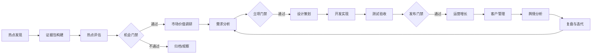

# Gem Cutter 产品需求文档

## 1. 产品定位

Gem Cutter 是一个一站式智能产品孵化 Agent 平台，围绕“发现热点 -> 评估机会 -> 设计方案 -> 开发交付 -> 运营增长 -> 客户管理 -> 舆情监控”的闭环，帮助个人开发者、创业团队、内容商业化团队、产品部门和投资/创新团队快速判断一个互联网热点是否值得做，并推动从想法到 MVP、上线和运营。

产品命名含义：像切割宝石一样，从大量噪声热点中识别有价值的机会，打磨成可交付、可运营、可增长的产品资产。

## 2. 背景与问题

互联网热点变化快，机会窗口短，但从热点到商业化通常会卡在几个环节：

- 信息搜集碎片化：热点分散在社媒、搜索、资讯、社区、电商、应用商店、广告平台等多个渠道。
- 评估不透明：很多判断依赖直觉，缺乏可追溯证据、评分模型和反证机制。
- 产品转化断层：调研报告和开发执行脱节，PRD、设计、开发、测试之间缺少统一上下文。
- 运营后链路缺失：上线后客户反馈、舆情、增长活动没有回流到产品迭代。
- Agent 不稳定：单一通用 Agent 容易“会聊不会交付”，缺少阶段状态、质量门禁和结构化产物。

Gem Cutter 要解决的是：把热点商业化过程拆成可审计、可迭代、可自动化协作的业务工作流。

## 3. 产品目标

### 3.1 业务目标

- 在 30 分钟内完成一个热点机会的初筛报告。
- 在 1 个工作日内完成一个候选机会的市场价值、竞品、需求、MVP 范围评估。
- 在 3 到 7 个工作日内支持从验证通过的机会生成可运行 MVP。
- 将上线后的客户反馈、舆情、运营数据自动回流到项目空间，形成持续迭代闭环。

### 3.2 产品目标

- 提供热点雷达、机会评分、商业分析、产品策划、开发执行、运营管理的一站式工作台。
- 所有关键结论必须绑定证据来源，避免无依据判断。
- 支持人机协作门禁：关键阶段由人确认是否继续投入。
- 支持多 Agent 分工：研究、市场、产品、设计、研发、测试、运营、舆情各司其职。
- 支持产物结构化：报告面向人阅读，JSON/数据库记录面向系统复用。

## 4. 用户角色

| 用户角色 | 主要诉求 | 核心使用场景 |
| --- | --- | --- |
| 独立开发者 | 快速判断做什么、怎么做、先做哪个功能 | 热点筛选、MVP 生成、上线验证 |
| 创业团队 | 寻找高潜机会并形成项目计划 | 市场评估、商业模式、PRD、路线图 |
| 企业创新团队 | 系统化跟踪趋势并立项 | 趋势雷达、投资价值、合规审查 |
| 产品经理 | 把热点转成需求和迭代计划 | 用户画像、需求分析、验收标准 |
| 研发团队 | 依据明确上下文开发和测试 | 架构设计、任务拆分、代码实现、测试 |
| 运营/增长团队 | 上线后拉新、转化、留存、舆情处理 | 活动策划、客户分层、舆情分析 |

## 5. 核心业务流程

## 6. 范围定义

### 6.1 MVP 范围

- 支持人工输入热点主题或关键词。
- 支持 Web 搜索、网页抓取、资料整理、证据包构建。
- 支持热点初筛评分和商业可行性评分。
- 支持生成机会报告、竞品分析、需求分析、MVP PRD。
- 支持项目空间、阶段看板、产物管理。
- 支持基础 Agent 编排：Lead Agent + 研究/市场/产品/开发/测试子 Agent。
- 支持 Markdown 报告和结构化 JSON 同步落库。

### 6.2 V1 范围

- 自动热点雷达：定时抓取多源数据并聚类。
- 支持趋势曲线、热度变化、情绪倾向、竞品监控。
- 支持设计方案、前端原型、后端接口、测试计划生成。
- 支持沙箱开发与运行结果展示。
- 支持客户反馈导入和基础 CRM。
- 支持舆情监控与风险预警。

### 6.3 V2 范围

- 多渠道数据接入：社媒、应用商店、电商、广告投放、工单系统、CRM。
- 支持增长实验、A/B 测试、营销内容生成。
- 支持团队协作、权限、审批、项目审计。
- 支持多租户 SaaS 化部署。
- 支持插件市场和行业模板。

### 6.4 暂不做

- 不在早期承诺完全自动公司注册、支付结算、法务合同生成。
- 不在 MVP 中接入所有社媒平台，先通过可用的搜索/抓取/MCP 接口验证主流程。
- 不把 Agent 结论作为最终法律、财务、医疗等高风险决策依据，必须保留人工复核。

## 7. 核心功能需求

### 7.1 热点发现

- 用户可以输入主题、关键词、行业、目标人群或地区。
- 系统可以检索相关网页、新闻、社区讨论、竞品页面。
- 系统可以按时间、来源、传播强度、情绪、商业相关性聚合热点。
- 系统输出热点列表，每条包含标题、摘要、来源、时间、热度指标、可信度。

验收标准：

- 每个热点至少有 3 条可点击证据来源。
- 每个热点都有生成时间、数据时间窗口和来源类型。
- 热点列表支持按热度、增长速度、商业评分排序。

### 7.2 证据包

- 系统为每个机会构建 Evidence Pack。
- 证据项包含 URL、标题、发布时间、抓取时间、摘要、原文片段、可信度、关联标签。
- 关键报告中的判断必须引用证据项。
- 证据包支持人工补充、删除、标注无效。

验收标准：

- 任一评分项可以追溯到证据项。
- 无证据结论必须标记为“推断”或“待验证”。

### 7.3 热点评估

评分维度：

| 维度 | 含义 |
| --- | --- |
| 热度强度 | 当前关注度、讨论量、搜索相关性 |
| 增长速度 | 最近时间窗口的增长变化 |
| 持续性 | 是否有长期需求或只是短期事件 |
| 用户痛点 | 是否对应明确问题和付费动机 |
| 竞争饱和度 | 是否已有大量成熟替代品 |
| 变现潜力 | 是否存在清晰商业模式 |
| 执行难度 | 技术、资源、渠道难度 |
| 风险 | 政策、版权、平台规则、伦理舆情 |

输出：

- `TrendScore`
- `OpportunityScore`
- 推荐动作：观察、深入调研、快速原型、放弃
- 风险和反证列表

### 7.4 市场价值调研

- 竞品识别：直接竞品、替代方案、潜在进入者。
- 用户画像：核心用户、次级用户、付费用户、决策者。
- 市场规模：TAM/SAM/SOM 粗估，必须标注假设。
- 商业模式：订阅、广告、交易抽成、服务费、工具付费、企业授权等。
- 定价假设：竞品价格、用户付费意愿、可测试价格区间。
- 渠道分析：搜索、社媒、内容、应用商店、私域、B2B 销售等。

验收标准：

- 输出竞品表和差异化机会。
- 输出至少 3 个关键假设和验证方法。
- 明确建议是否进入需求分析。

### 7.5 需求分析与产品策划

- 生成 PRD，包括背景、目标用户、核心场景、用户故事、功能范围、非功能需求。
- 拆分 MVP、V1、V2。
- 给出验收标准和关键埋点。
- 生成项目任务拆分和优先级。

验收标准：

- PRD 可以直接交给设计和研发使用。
- 每个 MVP 功能都有验收标准。
- 明确不做什么，避免范围膨胀。

### 7.6 设计、美术与开发

- 设计 Agent 生成信息架构、页面流程、交互说明、视觉方向。
- 开发 Agent 生成技术方案、接口设计、数据库设计、代码实现计划。
- 支持在沙箱中创建原型或代码。
- 支持前后端任务拆分和测试用例联动。

验收标准：

- 设计输出包含页面清单、关键流程、素材需求。
- 开发输出包含架构方案、模块拆分、运行说明。
- 生成代码必须通过基础构建或测试检查。

### 7.7 测试与发布

- QA Agent 生成测试计划、测试用例、边界场景和验收清单。
- 支持自动运行单元测试、接口测试、前端冒烟测试。
- 发布前必须检查合规、隐私、版权、数据来源风险。

验收标准：

- 发布门禁必须包含测试结果、已知问题、回滚方案。
- 未通过高风险项不得自动发布。

### 7.8 运营、客户管理与舆情分析

- 运营 Agent 生成增长计划、内容计划、投放假设、渠道实验。
- CRM 模块记录线索、客户分层、反馈、需求请求。
- 舆情 Agent 跟踪正负面反馈、传播风险、投诉主题。
- 运营和舆情结果回流到需求池。

验收标准：

- 每个运营实验都有目标、渠道、成本、指标和复盘。
- 负面舆情可以生成处理建议和响应话术。
- 客户反馈可以转化为需求候选项。

## 8. 非功能需求

| 类别 | 要求 |
| --- | --- |
| 可追溯性 | 报告结论必须关联证据项、时间窗口、Agent 版本 |
| 可扩展性 | 数据源、工具、Agent、评分模型可插件化 |
| 安全性 | 沙箱执行、路径隔离、密钥隔离、权限控制 |
| 可靠性 | 长任务可恢复、可取消、可重试、可查看进度 |
| 性能 | MVP 阶段单机会初筛不超过 30 分钟，常规报告可异步生成 |
| 可观测性 | 记录 Agent 调用、工具调用、Token、耗时、错误 |
| 合规性 | 标注来源、尊重 robots/平台规则，敏感领域强制人工复核 |

## 9. 关键指标

- 热点初筛报告完成时间。
- 每个报告平均证据数量。
- 机会评分被人工采纳率。
- 从机会到 PRD 的转化率。
- 从 PRD 到可运行 MVP 的周期。
- MVP 测试通过率。
- 上线后客户反馈转需求的闭环率。
- 舆情预警命中率。

