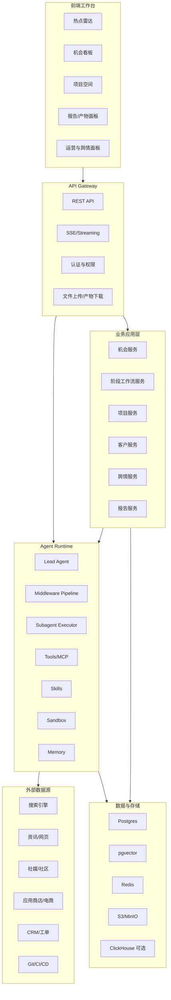
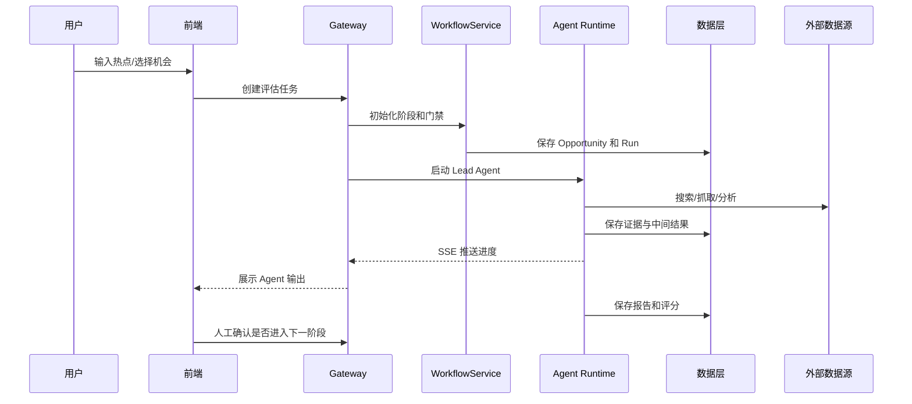

# Gem Cutter 总体架构设计

## 1. 架构原则

Gem Cutter 参考 DeerFlow 2 的 `Harness + App` 分层设计，但业务层更聚焦“热点到商业化产品”的阶段化交付。

核心原则：

- Runtime 与业务解耦：底层 Agent 编排、工具、沙箱、记忆、MCP 不绑定具体业务。
- 业务流程显式化：用阶段状态机和质量门禁约束 Agent 行为。
- 证据优先：任何商业判断必须有证据项或明确标记为假设。
- 产物双轨：Markdown 报告给人读，结构化数据给系统用。
- 人机协作：关键节点保留人工审批，降低自动化误判和合规风险。

## 2. 总体组件图



## 3. 分层说明

### 3.1 Frontend 工作台

建议使用 Next.js 实现，借鉴 DeerFlow 的 workspace 模式：

- 左侧：机会/项目列表、阶段状态、历史任务。
- 中间：对话与 Agent 进度流。
- 右侧：证据包、报告、PRD、代码产物、测试结果。
- 顶部：模式选择、模型选择、运行状态、成本统计。

核心页面：

- 热点雷达页
- 机会详情页
- 商业评估报告页
- 产品项目空间
- 开发任务与产物页
- 客户与舆情面板
- 系统配置页

### 3.2 Gateway API

职责：

- 对外提供 REST API 和 SSE streaming。
- 管理线程、运行、上传文件、产物下载。
- 管理业务实体：Topic、Opportunity、Project、Customer、SentimentSignal。
- 统一鉴权、限流、审计日志。
- 将前端请求转换为 Agent Runtime 可执行任务。

### 3.3 App 业务层

业务层不应该直接写在 Agent prompt 里，而应该有明确服务：

- `OpportunityService`：机会创建、评分、状态流转。
- `WorkflowService`：阶段门禁、任务生成、人工审批。
- `EvidenceService`：证据项存储、去重、可信度标注。
- `ReportService`：报告版本、导出、引用校验。
- `ProjectService`：PRD、设计、开发、测试产物管理。
- `CRMService`：线索、客户、反馈、需求回流。
- `SentimentService`：舆情信号、告警、处理记录。

### 3.4 Agent Runtime

建议沿用 DeerFlow 的思想：

- `Lead Agent`：总控和阶段协调。
- `Middleware`：线程数据、上传文件、沙箱、摘要、记忆、标题、工具异常处理、循环检测、子 Agent 限流。
- `Tools`：搜索、抓取、文件读写、代码执行、图像查看、报告保存、MCP 工具。
- `Skills`：行业研究、竞品分析、PRD、设计规范、测试规范、运营策略等。
- `Subagents`：专业 Agent 并行完成研究、市场、产品、开发、测试、运营、舆情任务。
- `Sandbox`：隔离代码执行和文件生成。

### 3.5 数据层

| 存储 | 用途 |
| --- | --- |
| Postgres | 业务主数据、工作流状态、报告元数据 |
| pgvector | 证据、报告、客户反馈的语义检索 |
| Redis | 异步任务、缓存、运行锁、限流 |
| S3/MinIO | 上传文件、截图、报告导出、设计素材、构建产物 |
| ClickHouse | 大规模热点时序、曝光、舆情趋势分析，V2 可引入 |

## 4. 运行流程



## 5. 技术栈建议

| 层 | 推荐技术 |
| --- | --- |
| 前端 | Next.js, React, TypeScript, Tailwind CSS, TanStack Query |
| API | FastAPI, Pydantic, SSE |
| Agent | LangGraph, LangChain, MCP, Skills, Sandbox |
| 任务 | Redis + RQ/Celery/Arq，后期可引入 Temporal |
| 数据库 | Postgres + pgvector |
| 对象存储 | MinIO/S3 |
| 可观测性 | OpenTelemetry, Langfuse/LangSmith 可选 |
| 部署 | Docker Compose 起步，后期 Kubernetes |

## 6. 与 DeerFlow 的对应关系

| DeerFlow 概念 | Gem Cutter 复用方式 |
| --- | --- |
| Harness | 作为通用 Agent Runtime 基础 |
| Lead Agent | 改造为商业孵化总控 Agent |
| Middleware Pipeline | 保留并扩展证据校验、阶段门禁、评分记录 |
| Skills | 新增热点分析、市场调研、PRD、运营舆情技能 |
| Subagents | 专业化为研究、市场、产品、开发、测试、运营 Agent |
| Sandbox | 用于原型生成、代码执行、测试运行 |
| Artifacts | 扩展为证据包、报告、PRD、设计稿、测试报告 |
| Workspace UI | 扩展为机会看板和项目空间 |

## 7. 推荐目录结构

```text
gem-cutter/
  backend/
    app/
      gateway/
      domain/
        topics/
        opportunities/
        evidence/
        workflows/
        projects/
        crm/
        sentiment/
        reports/
    packages/
      harness/
        gemcutter/
          agents/
          tools/
          skills/
          sandbox/
          runtime/
  frontend/
    src/
      app/
      components/
      core/
        topics/
        opportunities/
        workflows/
        projects/
        crm/
        sentiment/
  docs/
  skills/
```

