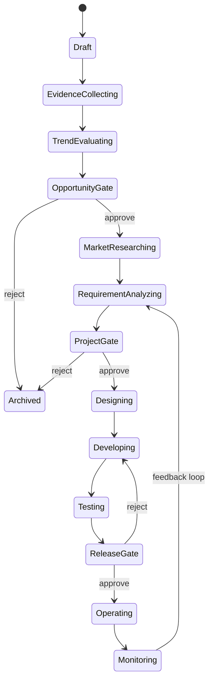

# Gem Cutter Agent 工作流设计

## 1. Agent 角色体系

Gem Cutter 使用一个总控 Agent 和多个专业 Agent。总控 Agent 负责理解用户目标、选择阶段、拆分任务、汇总结果、触发门禁；专业 Agent 负责在明确边界内完成具体工作。

| Agent | 职责 | 主要产物 |
| --- | --- | --- |
| LeadAgent | 总控、阶段推进、任务拆分、报告汇总 | 阶段计划、最终汇总 |
| HotspotScoutAgent | 热点检索、聚类、证据收集 | 热点列表、证据包 |
| TrendEvaluatorAgent | 热度、持续性、风险、机会评分 | 评分卡、风险清单 |
| MarketAnalystAgent | 竞品、市场规模、商业模式、定价 | 市场调研报告 |
| PMAgent | 需求分析、PRD、路线图、任务拆分 | PRD、MVP 范围 |
| DesignArtAgent | 信息架构、页面流程、视觉方向 | 设计说明、页面清单 |
| DevAgent | 技术方案、代码生成、运行修复 | 代码、运行说明 |
| QAAgent | 测试计划、自动化测试、验收 | 测试报告 |
| OpsAgent | 增长计划、运营实验、内容计划 | 运营计划、复盘 |
| CRMAgent | 客户分层、反馈分析、需求回流 | 客户洞察、需求候选 |
| SentimentAgent | 舆情监控、风险预警、响应建议 | 舆情报告、话术 |
| ComplianceAgent | 合规、版权、隐私、平台规则审查 | 风险审查报告 |

## 2. 阶段状态机

## 3. 阶段输入、处理与输出

| 阶段 | 输入 | 处理 Agent | 输出 | 门禁 |
| --- | --- | --- | --- | --- |
| 热点发现 | 关键词、链接、行业 | HotspotScoutAgent | Topic、EvidencePack | 无 |
| 热点评估 | Topic、EvidencePack | TrendEvaluatorAgent | TrendScore、OpportunityScore | 机会门禁 |
| 市场调研 | Opportunity | MarketAnalystAgent | 市场报告、竞品矩阵 | 可选 |
| 需求分析 | 市场报告 | PMAgent | PRD、MVP 范围 | 立项门禁 |
| 设计策划 | PRD | DesignArtAgent | 页面流程、设计说明 | 可选 |
| 开发实现 | PRD、设计说明 | DevAgent | 代码、运行说明 | 测试门禁 |
| 测试验收 | 代码、PRD | QAAgent | 测试报告 | 发布门禁 |
| 运营增长 | 发布版本 | OpsAgent | 运营计划、实验记录 | 复盘门禁 |
| 客户舆情 | 客户反馈、外部信号 | CRMAgent、SentimentAgent | 需求候选、舆情告警 | 人工处理 |

## 4. 评分模型

### 4.1 TrendScore

| 维度 | 权重 | 说明 |
| --- | --- | --- |
| 当前热度 | 20% | 搜索结果、讨论量、新闻密度 |
| 增长速度 | 20% | 近期变化趋势 |
| 持续性 | 20% | 是否对应长期需求 |
| 传播广度 | 15% | 来源类型和人群覆盖 |
| 情绪倾向 | 10% | 正负面比例 |
| 证据可信度 | 15% | 来源质量、重复验证 |

### 4.2 OpportunityScore

| 维度 | 权重 | 说明 |
| --- | --- | --- |
| 用户痛点 | 20% | 痛点明确度和频率 |
| 变现潜力 | 20% | 付费意愿、商业模式清晰度 |
| 竞争空间 | 15% | 竞品饱和度和差异化空间 |
| 执行可行性 | 15% | 技术、资源、时间成本 |
| 渠道可达性 | 10% | 是否能触达目标用户 |
| 风险可控性 | 10% | 合规、版权、平台风险 |
| 战略匹配度 | 10% | 是否符合团队能力和方向 |

## 5. 证据约束

Agent 输出必须遵循：

- 评分项必须绑定至少一个证据 ID，无法绑定时标记为 `assumption`。
- 市场规模必须标记估算假设，不得伪装成精确数据。
- 竞品结论必须包含竞品来源链接。
- 风险结论必须包含触发原因和建议处理动作。
- 报告必须包含“证据不足”和“需要人工验证”的内容。

## 6. LeadAgent 编排策略

LeadAgent 的默认策略：

1. 判断用户请求属于哪个阶段。
2. 检查该阶段必需输入是否存在。
3. 如缺少输入，先创建补充信息任务。
4. 对可并行任务启动专业子 Agent。
5. 汇总子 Agent 输出。
6. 校验证据、评分、产物完整性。
7. 更新 Opportunity 或 Project 状态。
8. 输出下一步建议和是否需要人工门禁。

## 7. Middleware 扩展建议

在 DeerFlow 风格 middleware 基础上新增：

| Middleware | 作用 |
| --- | --- |
| EvidenceGuardMiddleware | 检查报告结论是否引用证据 |
| StageGateMiddleware | 阶段门禁检查，防止越级推进 |
| ScoringTraceMiddleware | 保存评分维度、权重、证据映射 |
| ComplianceCheckMiddleware | 高风险领域强制插入合规审查 |
| CostBudgetMiddleware | 控制长任务调用成本 |
| ArtifactSchemaMiddleware | 校验产物 JSON schema |

## 8. Skills 设计

建议初始 Skills：

- `hotspot-research`：热点发现与证据采集方法。
- `business-feasibility`：商业可行性评分方法。
- `competitor-analysis`：竞品调研模板。
- `prd-writing`：PRD 生成规范。
- `frontend-prototype`：前端原型生成规范。
- `qa-plan`：测试计划与验收规范。
- `growth-ops`：增长运营实验设计。
- `sentiment-response`：舆情分级与响应话术。

