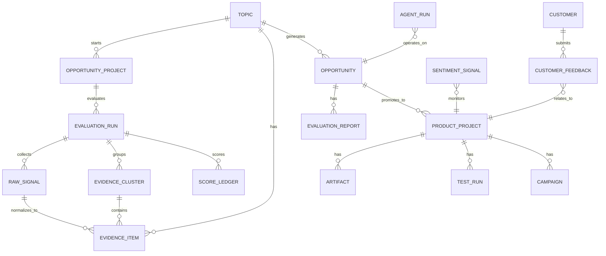

# Gem Cutter 数据模型设计

> 更新说明：MVP 完善版新增 `OpportunityProject`、`EvaluationRun`、`RawSignal`、`EvidenceCluster`、`ScoreLedger` 等关键实体。完整 MVP 设计见 [11-mvp-enhanced-design.md](11-mvp-enhanced-design.md)。

## 1. 设计原则

- 业务实体结构化保存，报告和产物单独版本化。
- 证据项作为一等实体，所有重要判断都通过 evidence_id 引用。
- Agent 运行记录和业务结果分离，便于审计和复盘。
- 向量索引用于检索证据、报告、客户反馈，不替代主数据库。

## 2. 核心实体关系



## 2.1 MVP 完善版新增实体

### OpportunityProject

| 字段 | 类型 | 说明 |
| --- | --- | --- |
| id | uuid | 主键 |
| topic_id | uuid | 来源 Topic |
| title | text | 项目标题 |
| input_topic | text | 用户原始输入 |
| target_market | text | 目标市场 |
| target_user_hint | text | 用户输入的目标用户线索 |
| constraints | jsonb | 预算、地区、时间窗口等约束 |
| status | text | created/evaluating/completed/failed/archived |
| latest_evaluation_run_id | uuid | 最近一次评估 |
| latest_report_id | uuid | 最近报告 |
| created_at | timestamptz | 创建时间 |
| updated_at | timestamptz | 更新时间 |

### EvaluationRun

| 字段 | 类型 | 说明 |
| --- | --- | --- |
| id | uuid | 主键 |
| project_id | uuid | 关联 OpportunityProject |
| topic_id | uuid | 关联 Topic |
| status | text | pending/running/completed/failed/cancelled |
| stage | text | planning/collecting_signals/normalizing_evidence/enriching_evidence/clustering_evidence/scoring/gate_review/rendering |
| progress | numeric | 0-100 |
| message | text | 当前状态消息 |
| plan | jsonb | EvaluationPlan |
| budget | jsonb | 查询、LLM、时间预算 |
| error | text | 错误信息 |
| started_at | timestamptz | 开始时间 |
| finished_at | timestamptz | 结束时间 |

### RawSignal

| 字段 | 类型 | 说明 |
| --- | --- | --- |
| id | uuid | 主键 |
| evaluation_run_id | uuid | 关联 EvaluationRun |
| source_adapter | text | web_search/news_search/manual/social_db |
| source_platform | text | 来源平台 |
| source_type | text | web/news/community/official/report/manual |
| query | text | 触发采集的查询 |
| url | text | 链接 |
| raw_payload | jsonb | 原始结果 |
| fetched_at | timestamptz | 采集时间 |
| normalization_status | text | pending/success/failed |
| error | text | 错误信息 |

### EvidenceCluster

| 字段 | 类型 | 说明 |
| --- | --- | --- |
| id | uuid | 主键 |
| evaluation_run_id | uuid | 关联 EvaluationRun |
| dimension | text | 评分维度 |
| label | text | 聚类标签 |
| summary | text | 聚类摘要 |
| representative_evidence_ids | jsonb | 代表证据 |
| evidence_count | int | 证据数量 |
| source_diversity | numeric | 来源多样性 |
| avg_hotness_score | numeric | 平均热度 |
| avg_sentiment_score | numeric | 平均情感 |
| time_range_start | timestamptz | 最早时间 |
| time_range_end | timestamptz | 最晚时间 |

### ScoreLedger

| 字段 | 类型 | 说明 |
| --- | --- | --- |
| id | uuid | 主键 |
| evaluation_run_id | uuid | 关联 EvaluationRun |
| dimension | text | trend_strength/user_pain/monetization/competition_gap/execution_feasibility/public_opinion_risk/timing_window |
| score | numeric | 0-100 |
| confidence | numeric | 0-1 |
| weight | numeric | 权重 |
| rationale | text | 评分解释 |
| positive_evidence_ids | jsonb | 正向证据 |
| negative_evidence_ids | jsonb | 反向证据 |
| missing_evidence | jsonb | 缺口 |
| assumptions | jsonb | 假设 |
| created_at | timestamptz | 创建时间 |

## 3. Topic

表示一个热点主题。

| 字段 | 类型 | 说明 |
| --- | --- | --- |
| id | uuid | 主键 |
| title | text | 热点标题 |
| keywords | jsonb | 关键词 |
| summary | text | 摘要 |
| source_window | jsonb | 数据时间窗口 |
| heat_score | numeric | 热度分 |
| trend_status | text | rising/stable/falling/unknown |
| created_at | timestamptz | 创建时间 |
| updated_at | timestamptz | 更新时间 |

## 4. EvidenceItem

表示证据项。

| 字段 | 类型 | 说明 |
| --- | --- | --- |
| id | uuid | 主键 |
| topic_id | uuid | 关联 Topic |
| opportunity_id | uuid | 可选关联 Opportunity |
| evaluation_run_id | uuid | 可选关联 EvaluationRun |
| raw_signal_id | uuid | 可选关联 RawSignal |
| cluster_id | uuid | 可选关联 EvidenceCluster |
| dimension | text | 关联评分维度 |
| source_type | text | web/news/social/report/store/manual |
| source_platform | text | 来源平台 |
| content_type | text | 内容类型 |
| url | text | 来源链接 |
| title | text | 来源标题 |
| author | text | 作者或机构 |
| published_at | timestamptz | 发布时间 |
| captured_at | timestamptz | 抓取时间 |
| raw_text_path | text | 原文对象存储路径 |
| summary | text | 摘要 |
| credibility | numeric | 可信度 0-1 |
| relevance_score | numeric | 相关性 0-1 |
| freshness_score | numeric | 新鲜度 0-1 |
| hotness_score | numeric | 热度 0-1 |
| sentiment_label | text | positive/neutral/negative/mixed/unknown |
| sentiment_score | numeric | 情感分 |
| stance_label | text | support/oppose/neutral/unknown |
| engagement_metrics | jsonb | 点赞、评论、转发、播放等 |
| dedupe_hash | text | 去重指纹 |
| tags | jsonb | 标签 |
| status | text | candidate/valid/duplicate/invalid/failed/manually_added/low_confidence |

## 5. Opportunity

表示商业机会。

| 字段 | 类型 | 说明 |
| --- | --- | --- |
| id | uuid | 主键 |
| topic_id | uuid | 来源热点 |
| name | text | 机会名称 |
| description | text | 机会描述 |
| target_users | jsonb | 目标用户 |
| stage | text | 当前阶段 |
| trend_score | numeric | 热点评分 |
| opportunity_score | numeric | 商业机会评分 |
| risk_level | text | low/medium/high/critical |
| recommendation | text | observe/research/prototype/archive |
| owner_id | uuid | 负责人 |
| created_at | timestamptz | 创建时间 |
| updated_at | timestamptz | 更新时间 |

## 6. EvaluationReport

表示阶段报告。

| 字段 | 类型 | 说明 |
| --- | --- | --- |
| id | uuid | 主键 |
| opportunity_id | uuid | 关联机会 |
| report_type | text | trend/market/prd/design/test/ops/sentiment |
| version | int | 版本号 |
| title | text | 标题 |
| markdown_path | text | Markdown 报告访问 URI，例如 `sqlite://reports/{report_id}/markdown` |
| markdown | text | 当前本地 SQLite 实现中的 Markdown 正文 |
| structured_data | jsonb | 结构化结果 |
| evidence_refs | jsonb | 引用 evidence_id 列表 |
| agent_run_id | uuid | 生成该报告的 AgentRun |
| status | text | draft/final/archived |
| created_at | timestamptz | 创建时间 |

## 7. ProductProject

表示进入开发阶段的产品项目。

| 字段 | 类型 | 说明 |
| --- | --- | --- |
| id | uuid | 主键 |
| opportunity_id | uuid | 来源机会 |
| name | text | 项目名称 |
| repo_url | text | 代码仓库 |
| current_version | text | 当前版本 |
| status | text | planning/designing/developing/testing/released/operating |
| prd_report_id | uuid | PRD 报告 |
| design_report_id | uuid | 设计报告 |
| created_at | timestamptz | 创建时间 |
| updated_at | timestamptz | 更新时间 |

## 8. Artifact

表示产物。

| 字段 | 类型 | 说明 |
| --- | --- | --- |
| id | uuid | 主键 |
| project_id | uuid | 关联项目 |
| artifact_type | text | report/code/design/test/build/screenshot |
| name | text | 产物名称 |
| path | text | 对象存储或工作区路径 |
| metadata | jsonb | 元数据 |
| created_by_run_id | uuid | AgentRun |
| created_at | timestamptz | 创建时间 |

## 9. AgentRun

记录 Agent 执行。

| 字段 | 类型 | 说明 |
| --- | --- | --- |
| id | uuid | 主键 |
| thread_id | uuid | 对话/线程 |
| agent_name | text | Agent 名称 |
| target_type | text | topic/opportunity/project/customer/sentiment |
| target_id | uuid | 目标实体 |
| status | text | pending/running/success/error/cancelled |
| input | jsonb | 输入摘要 |
| output | jsonb | 输出摘要 |
| token_usage | jsonb | Token 统计 |
| cost | numeric | 成本估算 |
| error | text | 错误信息 |
| started_at | timestamptz | 开始时间 |
| finished_at | timestamptz | 结束时间 |

## 10. CRM 与舆情实体

### Customer

| 字段 | 类型 | 说明 |
| --- | --- | --- |
| id | uuid | 主键 |
| name | text | 客户名称 |
| segment | text | 客户分层 |
| contact | jsonb | 联系方式 |
| source | text | 来源渠道 |
| status | text | lead/trial/paid/churned |
| created_at | timestamptz | 创建时间 |

### CustomerFeedback

| 字段 | 类型 | 说明 |
| --- | --- | --- |
| id | uuid | 主键 |
| customer_id | uuid | 客户 |
| project_id | uuid | 项目 |
| content | text | 反馈内容 |
| sentiment | text | positive/neutral/negative |
| priority | text | P0/P1/P2/P3 |
| converted_requirement_id | uuid | 转化需求 |
| created_at | timestamptz | 创建时间 |

### SentimentSignal

| 字段 | 类型 | 说明 |
| --- | --- | --- |
| id | uuid | 主键 |
| project_id | uuid | 项目 |
| source_type | text | 来源 |
| url | text | 链接 |
| content_summary | text | 摘要 |
| sentiment | text | 情绪 |
| risk_level | text | 风险等级 |
| recommended_action | text | 建议动作 |
| created_at | timestamptz | 创建时间 |

## 11. 向量索引

建议建立向量索引：

- evidence_embeddings：证据语义检索。
- report_embeddings：报告片段检索。
- feedback_embeddings：客户反馈聚类。
- sentiment_embeddings：舆情主题聚类。

向量记录应保存：

- source_table
- source_id
- chunk_index
- chunk_text
- embedding
- metadata

## 12. 对象存储路径建议

```text
s3://gem-cutter/
  topics/{topic_id}/evidence/{evidence_id}.json
  topics/{topic_id}/snapshots/{evidence_id}.html
  opportunities/{opportunity_id}/reports/{report_type}/v{version}.md
  projects/{project_id}/artifacts/{artifact_id}/
  runs/{run_id}/logs/
```
