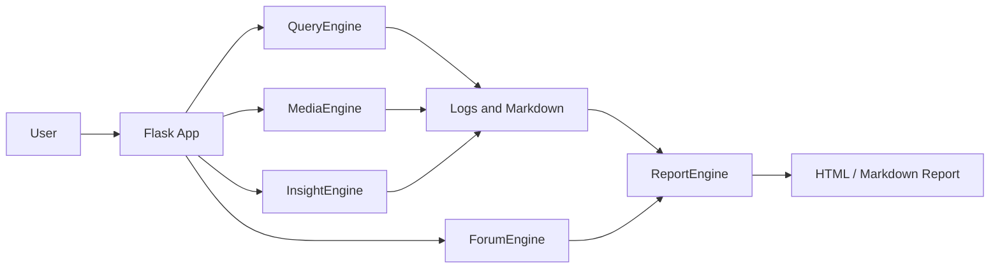
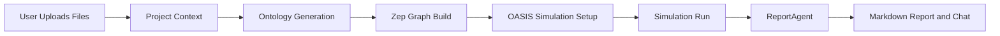
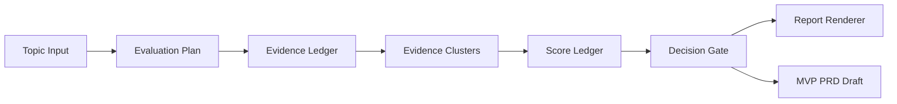
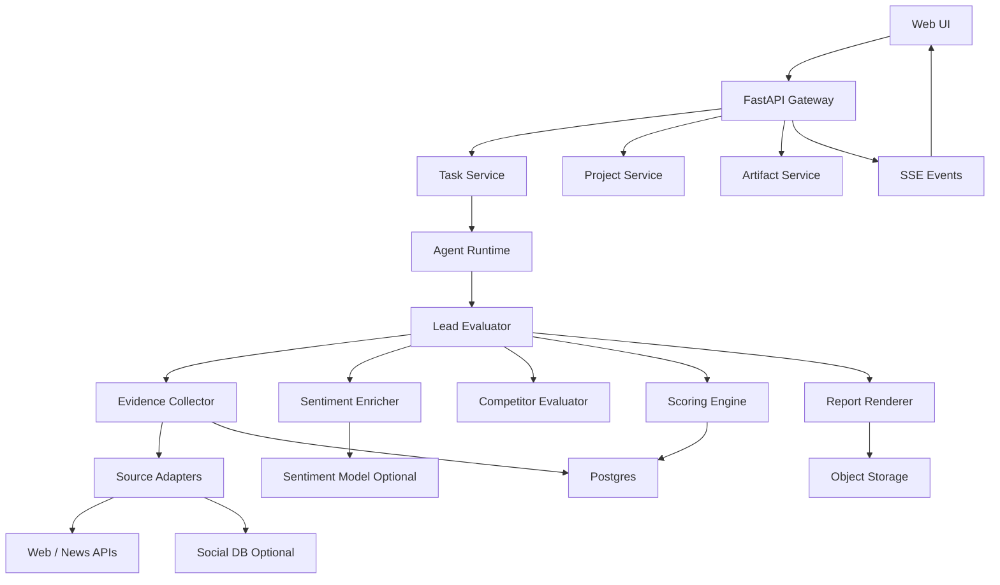
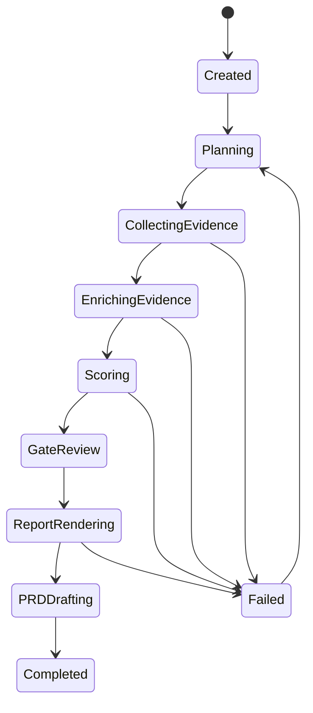
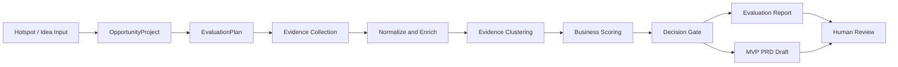

# BettaFish / MiroFish 对标分析与 MVP 优化方案

本文基于以下本地源码进行分析：

- `C:\Users\Trivedi\projects\github-cloned\BettaFish`
- `C:\Users\Trivedi\projects\github-cloned\MiroFish`
- 已有 Gem Cutter 规划文档：`docs/08-mvp-scope-and-development-plan.md`、`docs/09-mvp-business-evaluation-chain-design.md`

目标不是直接复刻两个舆情项目，而是提炼可迁移的架构模式，优化 Gem Cutter MVP 的商业评估链路、舆情输入、证据管理、任务状态和报告生成方式。

## 1. 结论摘要

BettaFish 更适合借鉴“舆情数据采集、热度计算、情感分析、搜索反思、报告装配”的能力；MiroFish 更适合借鉴“项目状态机、长任务进度、知识图谱检索、报告章节化生成、可视化过程面板”的能力。

Gem Cutter MVP 不建议直接复制 BettaFish 的多进程 Streamlit 编排，也不建议把 MiroFish 的 Zep/OASIS 仿真完整纳入 MVP。MVP 的正确收敛点应是：

1. 以 DeerFlow 风格的 Agent Runtime 作为主编排层。
2. 以 BettaFish 的平台证据、热度、情感、聚类思想增强 Evidence Pipeline。
3. 以 MiroFish 的项目上下文、任务状态、报告章节化生成思想增强 Evaluation Run。
4. 以结构化 Evidence Ledger 和 Score Ledger 作为主资产，报告只是渲染结果。
5. 将“仿真/人物访谈/图谱推演”作为 V1/V2 的增强能力，不进入 MVP 主链路。

## 2. BettaFish 架构分析

### 2.1 总体结构

BettaFish 是一个多引擎舆情分析系统，核心由多个相对独立的引擎组成：

| 模块 | 主要职责 | 可迁移价值 |
| --- | --- | --- |
| `app.py` | Flask 主应用、SocketIO、启动/停止 Streamlit 子应用、ForumEngine 日志监控 | 可参考控制台/运行状态呈现，不建议复制进程编排方式 |
| `QueryEngine` | Web/新闻深度搜索、报告结构规划、反思式补搜、总结 | 可迁移为 MVP 的 Web Evidence Collector |
| `MediaEngine` | 多模态/综合搜索，支持 Bocha/Anspire 等搜索工具 | 可迁移为后续多模态证据源，MVP 可只保留适配器接口 |
| `InsightEngine` | 基于本地 MediaCrawlerDB 的舆情检索、热度计算、情感分析、聚类 | 对 MVP 舆情证据层最有价值 |
| `ReportEngine` | 模板选择、章节生成、Document IR 校验、HTML 渲染 | 可迁移结构化报告思想，MVP 不建议复制复杂渲染器 |
| `ForumEngine` | 读取各引擎日志，触发主持人总结和多 Agent 讨论 | 可参考多 Agent 协作事件，但应替换为一等事件流 |
| `MindSpider` | 热榜采集、关键词抽取、深度舆情爬取 | 可作为 V1 数据采集 Worker 的参考 |
| `SentimentAnalysisModel` | BERT/GPT2/Qwen/传统 ML 情感模型 | 可作为情感模型插件库参考 |

BettaFish 的典型运行方式偏“多应用拼装”：Flask 主控启动 Streamlit 子应用，几个引擎各自输出 Markdown/日志，再由 ForumEngine 和 ReportEngine 消费日志/产物。



### 2.2 QueryEngine：搜索-反思-总结模式

`QueryEngine` 的核心类是 `DeepSearchAgent`。它先生成报告结构，再对每个段落执行初始搜索、总结、反思式补搜，最后生成完整报告。

关键模式：

- `ReportStructureNode` 先将问题拆成报告段落。
- `FirstSearchNode` 为每个段落生成搜索 query 和工具选择。
- `FirstSummaryNode` 生成初始段落摘要。
- `ReflectionNode` 判断还缺什么信息并补搜。
- `ReflectionSummaryNode` 将新增搜索结果合并进段落状态。
- `ReportFormattingNode` 最终整合输出报告。

可迁移点：

- 对商业评估来说，可以把“段落”换成“评估维度”：趋势强度、需求痛点、付费意愿、竞争格局、可执行性、风险。
- 每个维度都可以有自己的检索计划、缺口判断、补证据循环。
- `State` 中保存 query、段落、搜索历史、最新摘要、反思轮次的做法，适合改造成 Gem Cutter 的 `EvaluationRunState`。

不建议照搬点：

- QueryEngine 以“报告段落”为主状态，证据没有被提升为一等实体。
- 搜索结果主要进入 prompt 和 Markdown，不利于后续审计、评分复算、对接产品开发链路。
- JSON 解析/修复依赖若干兜底函数，MVP 应优先使用 Pydantic/Zod schema 校验和明确的失败状态。

### 2.3 InsightEngine：舆情数据库、热度与情感能力

`InsightEngine` 对 Gem Cutter 的 MVP 价值最高。它基于本地 `MediaCrawlerDB` 查询多平台内容与评论，并封装为工具：

- `search_hot_content`
- `search_topic_globally`
- `search_topic_by_date`
- `get_comments_for_topic`
- `search_topic_on_platform`
- `analyze_sentiment`

其中 `QueryResult` 的字段非常贴近 Gem Cutter 的 EvidenceItem：

| BettaFish 字段 | Gem Cutter 建议字段 | 用途 |
| --- | --- | --- |
| `platform` | `source_platform` | 来源平台 |
| `content_type` | `content_type` | 内容/评论/新闻/视频等类型 |
| `title_or_content` | `content` / `title` | 证据正文 |
| `author_nickname` | `author` | 作者 |
| `url` | `url` | 可追溯链接 |
| `publish_time` | `published_at` | 时效性 |
| `engagement` | `engagement_metrics` | 点赞、评论、转发、播放等 |
| `hotness_score` | `hotness_score` | 热度归一化分 |
| `source_table` | `source_ref` | 原始数据表或采集源 |

InsightEngine 的平台热度计算值得迁移为 MVP 的 `HotnessNormalizer`：不同平台有不同互动字段，不能简单相加，应该先按平台归一化，再做跨平台比较。

建议在 MVP 中引入以下结构：

```text
RawSignal
  -> SourceNormalizer
  -> EvidenceItem
  -> HotnessNormalizer
  -> SentimentEnricher
  -> EvidenceCluster
  -> ScoreLedger
```

### 2.4 MediaEngine：多模态搜索能力

`MediaEngine` 与 `QueryEngine` 的链路类似，但搜索工具换成 Bocha/Anspire 等综合或多模态搜索：

- `comprehensive_search`
- `web_search_only`
- `search_for_structured_data`
- `search_last_24_hours`
- `search_last_week`

可迁移点：

- 将搜索能力封装为统一 `SearchProvider`，支持 `web`、`news`、`structured`、`recent`、`multimodal` 不同 search mode。
- MVP 可先只实现 `web/news/recent`，但接口上保留 `modality` 字段，便于 V1 支持图片、视频、短视频平台内容。

不建议 MVP 做的事：

- 不要把多模态搜索作为商业评估的必备依赖。
- 不要让 LLM 自由选择过多工具；工具选择需要被 `EvaluationPlan` 限制，否则成本和不确定性会放大。

### 2.5 ReportEngine：结构化报告生成

`ReportEngine` 包含模板选择、Document IR、校验器、HTML 渲染器、章节存储、fallback LLM 等较完整链路。

值得迁移的设计：

- 报告先生成结构化 IR，再渲染为 HTML/Markdown。
- 每个章节可独立生成、保存和恢复。
- LLM 输出先校验再渲染。
- 支持模板选择与章节级 word budget。

MVP 适配建议：

- 先不要实现复杂 Document IR。
- 把 `BusinessEvaluationReport` 作为更小的 IR：`summary`、`scores`、`evidence_by_dimension`、`risks`、`recommendation`、`next_mvp_plan`。
- Markdown 报告由结构化 JSON 渲染得到，而不是由 LLM 一次性自由生成。

### 2.6 ForumEngine：日志驱动的多 Agent 协作

ForumEngine 通过监控 `insight.log`、`media.log`、`query.log`，解析 SummaryNode 输出，触发主持人总结。这很适合原型，但对 Gem Cutter 不宜照搬。

问题：

- 日志变成业务协议，脆弱且难测试。
- 事件语义散落在文本中，不利于追踪和审计。
- 难以做失败恢复和权限控制。

Gem Cutter 应改为：

- 使用 Agent Runtime 原生事件：`tool_call_started`、`tool_call_completed`、`evidence_added`、`score_updated`、`gate_decided`。
- 前端只消费结构化事件流或 task progress。
- 日志作为可观测性输出，而不是业务输入。

## 3. MiroFish 架构分析

### 3.1 总体结构

MiroFish 是一个“图谱 + 仿真 + 报告”的多阶段系统。它的链路更像产品化工作台：

1. 上传 PDF/MD/TXT 等材料，输入仿真需求。
2. 生成 ontology。
3. 将文本切块写入 Zep Graph，构建 GraphRAG。
4. 基于图谱实体生成 OASIS/CAMEL 仿真环境。
5. 运行多 Agent 仿真。
6. ReportAgent 基于图谱和仿真结果生成预测报告。
7. 支持报告后续问答与图谱检索。



MiroFish 的技术栈：

- Backend：Flask、Flask-CORS、OpenAI-compatible LLM、Zep Cloud、CAMEL/OASIS、Pydantic。
- Frontend：Vue 3、Vite、Axios、D3、vue-i18n、vue-router。
- 状态：项目 JSON 文件、任务内存态、仿真目录和报告目录。

### 3.2 ProjectManager：服务端项目上下文

MiroFish 的 `Project` 模型包括：

- `project_id`
- `name`
- `status`
- `files`
- `total_text_length`
- `ontology`
- `analysis_summary`
- `graph_id`
- `graph_build_task_id`
- `simulation_requirement`
- `chunk_size`
- `chunk_overlap`
- `error`

这是 Gem Cutter 可直接吸收的思想：前端不应该在每个接口之间传递大量中间结果，所有运行上下文应由服务端持久化。

Gem Cutter MVP 建议对应为：

```text
OpportunityProject
  id
  title
  input_topic
  target_market
  user_segment
  status
  evidence_run_id
  evaluation_run_id
  latest_report_id
  created_at
  updated_at
```

### 3.3 TaskManager：长任务状态与进度

MiroFish 的 `TaskManager` 提供：

- `task_id`
- `task_type`
- `status`
- `progress`
- `message`
- `result`
- `error`
- `metadata`
- `progress_detail`

Gem Cutter MVP 的商业评估任务是典型长任务，不应阻塞 HTTP 请求。建议采用：

- 后端：`POST /api/evaluations` 创建任务并立即返回 `evaluation_run_id` 和 `task_id`。
- 前端：使用 SSE 或轮询读取任务事件。
- Runtime：每个阶段持续写入进度与结构化事件。

MVP 阶段可以先用 Postgres 持久化任务状态；如果第一版暂不引入队列，也要把接口设计成异步任务形态，后续可平滑迁移到 Celery/RQ/Temporal。

### 3.4 ZepTools 与图谱检索

MiroFish 的 Zep 工具服务包括：

- `search_graph`
- `get_all_nodes`
- `get_all_edges`
- `get_node_detail`
- `get_node_edges`
- `get_entities_by_type`
- `get_entity_summary`
- `get_graph_statistics`
- `get_simulation_context`
- `insight_forge`
- `panorama_search`
- `quick_search`
- `interview_agents`

其中 `insight_forge` 会自动生成子问题并组合多次图谱检索，`panorama_search` 用于获取全貌和时间演化，`quick_search` 用于快速验证事实。

对 Gem Cutter 的启发：

- 可以把 `insight_forge` 改造成 `evidence_forge`：围绕商业评估维度自动生成子问题，检索 Web/News/DB/Vector 证据。
- 可以把 `panorama_search` 改造成 `market_panorama`：输出市场趋势、竞品、用户痛点、政策风险、替代方案。
- 可以把 `quick_search` 改造成 `fact_check`：验证某条评分依据或报告中的关键断言。

MVP 不建议直接依赖 Zep：

- 商业评估 MVP 的数据源主要是搜索结果和结构化证据，不一定需要知识图谱。
- Zep/OASIS 会引入外部服务依赖、成本和部署复杂度。
- 图谱可以作为 V1 “舆情实体关系/竞争格局关系”增强模块。

### 3.5 ReportAgent：ReACT 章节化报告

MiroFish 的 `ReportAgent` 有清晰的报告生成结构：

- `ReportStatus`：`pending`、`planning`、`generating`、`completed`、`failed`
- `ReportOutline`：标题、摘要、章节列表
- `ReportSection`：标题、内容
- `Report`：报告 ID、仿真 ID、图谱 ID、需求、状态、Markdown 内容
- 工具：`insight_forge`、`panorama_search`、`quick_search`、`interview_agents`
- 生成过程：先规划大纲，再逐章节 ReACT 检索和生成，并限制每章节工具调用次数。

可迁移点：

- 报告生成应拆成 planning 和 section generation。
- 每个章节应有工具调用上限、格式错误修复、失败 fallback。
- 报告生成过程要可恢复：章节、进度、日志分开保存。

需要调整点：

- MiroFish 的报告是面向“未来预测/仿真世界”的，Gem Cutter 是面向“商业决策/产品孵化”的。
- MVP 不应该强制每个章节最少调用固定数量工具。商业评估应按证据缺口和置信度决定补搜。
- 报告不能替代评分：先有 Score Ledger，再由报告解释评分。

## 4. 对 Gem Cutter MVP 的优化原则

### 4.1 从“报告主导”改为“证据和评分主导”

BettaFish 和 MiroFish 都有强烈的报告产出导向。Gem Cutter 的目标更偏商业决策和产品开发，因此 MVP 的主链路应是：



核心原则：

- Evidence Ledger 存储原始证据、来源、时间、可信度、热度、情感和归属维度。
- Score Ledger 存储每个维度的分数、权重、引用证据和计算解释。
- Report Renderer 只读取结构化数据生成 Markdown/HTML。
- PRD Draft 只在 `go` 或 `conditional_go` 时生成。

### 4.2 从“日志驱动协作”改为“事件驱动协作”

MVP 应定义一组领域事件：

| 事件 | 触发时机 | 前端用途 |
| --- | --- | --- |
| `evaluation.started` | 创建评估任务 | 显示任务开始 |
| `plan.created` | 生成评估计划 | 显示维度和检索计划 |
| `evidence.search_started` | 某个维度开始检索 | 显示当前检索目标 |
| `evidence.added` | 新证据入账 | 更新证据列表 |
| `evidence.clustered` | 证据聚类完成 | 显示主题簇 |
| `sentiment.updated` | 情感分析完成 | 更新舆情视图 |
| `score.updated` | 某维度评分完成 | 更新评分雷达/表格 |
| `gate.decided` | 作出 go/hold/stop | 显示决策 |
| `report.generated` | 报告生成完成 | 显示报告 |
| `prd.generated` | MVP PRD 草稿完成 | 显示下一步产物 |
| `evaluation.failed` | 任务失败 | 显示可恢复错误 |

### 4.3 从“平台耦合工具”改为“Source Adapter”

BettaFish 的平台工具可为 Gem Cutter 提供采集逻辑参考，但 MVP 代码结构应采用适配器边界：

```text
SourceAdapter
  - WebSearchAdapter
  - NewsSearchAdapter
  - SocialDBAdapter
  - MediaCrawlerAdapter
  - ManualEvidenceAdapter
```

每个 adapter 输出统一的 `RawSignal`，再进入归一化层。这样后续接入小红书、微博、知乎、B站、抖音或内部数据库时，不会污染评分链路。

### 4.4 从“LLM 自由编排”改为“计划约束下的 Agent”

MVP 的 Lead Agent 不能只靠 prompt 自由决定怎么查。建议引入 `EvaluationPlan`：

```json
{
  "topic": "string",
  "dimensions": [
    {
      "name": "trend_strength",
      "questions": ["string"],
      "required_evidence_count": 5,
      "preferred_sources": ["news", "web", "social"],
      "freshness_days": 30
    }
  ],
  "budget": {
    "max_search_queries": 24,
    "max_llm_calls": 40,
    "max_runtime_seconds": 600
  }
}
```

工具调用必须绑定到某个 dimension 和 question，避免“查了很多但不能评分”。

## 5. MVP 目标架构优化

### 5.1 推荐模块图



### 5.2 MVP 模块职责

| 模块 | 职责 | 参考来源 |
| --- | --- | --- |
| `ProjectService` | 保存评估项目、用户输入、阶段状态 | MiroFish ProjectManager |
| `TaskService` | 异步任务、进度、错误、结果 | MiroFish TaskManager |
| `AgentRuntime` | 编排 Agent、工具、事件、状态 | DeerFlow |
| `EvidenceCollector` | 按维度检索和归一化证据 | BettaFish QueryEngine/InsightEngine |
| `HotnessNormalizer` | 跨平台热度归一化 | BettaFish InsightEngine |
| `SentimentEnricher` | 情感/立场/风险倾向标注 | BettaFish SentimentAnalysisModel |
| `EvidenceClusterer` | 证据去重、聚类、代表样本 | BettaFish InsightEngine |
| `ScoringEngine` | 维度评分、置信度、决策门 | Gem Cutter 自研 |
| `ReportRenderer` | 从结构化报告渲染 Markdown/HTML | BettaFish ReportEngine + MiroFish ReportAgent |
| `PRDGenerator` | 生成 MVP PRD 草案 | Gem Cutter 自研 |

### 5.3 MVP 推荐状态机



每个状态必须可持久化，且能从最近的成功 checkpoint 恢复。

## 6. 数据模型优化

### 6.1 新增 RawSignal

从 BettaFish 得到的启发是：平台原始数据字段差异很大，不能直接变成 EvidenceItem。建议在 EvidenceItem 前增加 RawSignal。

```text
RawSignal
  id
  source_adapter
  source_platform
  source_type
  raw_payload
  fetched_at
  query
  crawl_job_id
  normalization_status
```

### 6.2 增强 EvidenceItem

```text
EvidenceItem
  id
  evaluation_run_id
  dimension
  title
  content
  url
  source_platform
  content_type
  author
  published_at
  fetched_at
  engagement_metrics
  hotness_score
  sentiment_label
  sentiment_score
  stance_label
  credibility_score
  freshness_score
  relevance_score
  dedupe_hash
  cluster_id
  raw_signal_id
```

### 6.3 新增 EvidenceCluster

```text
EvidenceCluster
  id
  evaluation_run_id
  dimension
  label
  summary
  representative_evidence_ids
  evidence_count
  avg_hotness_score
  avg_sentiment_score
  source_diversity
  time_range_start
  time_range_end
```

### 6.4 新增 ScoreLedger

```text
ScoreLedger
  id
  evaluation_run_id
  dimension
  score
  confidence
  weight
  rationale
  positive_evidence_ids
  negative_evidence_ids
  missing_evidence
  created_at
```

## 7. 商业评估链路优化

### 7.1 评估维度

MVP 建议维度从 6 个扩展为 7 个，但前端可聚合展示：

| 维度 | 权重 | 输入证据 |
| --- | --- | --- |
| 趋势强度 | 20% | 热度增长、跨平台覆盖、时效性、搜索量代理指标 |
| 用户痛点 | 18% | 评论诉求、负面情绪、替代方案抱怨、问答平台问题 |
| 付费/转化可能性 | 18% | 竞品价格、用户购买意图、商业场景、B端预算 |
| 竞争格局 | 14% | 现有产品数量、差异化空间、进入壁垒 |
| 实现可行性 | 12% | 技术复杂度、数据可得性、MVP 周期、合规限制 |
| 舆情风险 | 10% | 负面情绪、政策敏感、品牌风险、伦理风险 |
| 时机窗口 | 8% | 新鲜度、事件生命周期、是否可持续 |

### 7.2 Gate 规则

```text
go:
  total_score >= 75
  confidence >= 0.68
  no critical compliance risk

conditional_go:
  total_score >= 62
  confidence >= 0.55
  missing evidence can be resolved in <= 3 days

hold:
  total_score between 50 and 62
  or confidence below 0.55

stop:
  total_score < 50
  or critical compliance risk
  or market evidence contradicts core assumption
```

### 7.3 证据缺口驱动补搜

借鉴 QueryEngine 的 reflection loop，但补搜条件不由“段落是否写完整”决定，而由结构化缺口决定：

```text
if dimension.evidence_count < required_count:
  search_more(dimension)

if source_diversity < 2:
  search_other_sources(dimension)

if confidence < threshold and score impacts gate:
  fact_check_top_claims(dimension)

if sentiment_conflict_high:
  cluster_comments_and_extract_arguments(dimension)
```

## 8. Skill / Prompt 优化

### 8.1 推荐 Skill 列表

| Skill | 作用 | 借鉴来源 |
| --- | --- | --- |
| `hotspot-evidence-collection` | 生成检索计划、调用 SourceAdapter、入账 EvidenceItem | QueryEngine / MediaEngine |
| `social-signal-normalization` | 归一化互动指标、热度、平台字段 | InsightEngine |
| `sentiment-and-stance-analysis` | 情感、立场、风险倾向标注 | SentimentAnalysisModel |
| `business-feasibility-scoring` | 维度评分和置信度计算 | Gem Cutter 自研 |
| `competitor-landscape` | 竞品识别、定位、价格和差异化 | QueryEngine + Web Search |
| `report-rendering` | 将结构化结果渲染为 Markdown | ReportEngine / ReportAgent |
| `mvp-prd-drafting` | 基于 Gate 输出 PRD 草案 | Gem Cutter 自研 |

### 8.2 Lead Evaluator Prompt 约束

Lead Evaluator 的系统提示应强调：

- 你不是直接写报告，而是维护 Evidence Ledger 和 Score Ledger。
- 所有评分必须引用证据 ID。
- 没有足够证据时输出 evidence_gap，而不是编造。
- 工具调用必须绑定 `dimension` 和 `research_question`。
- 最终报告必须从结构化结果渲染，不得绕过 schema。

示例核心约束：

```text
你负责商业机会评估，不负责直接自由写作。
每一步必须更新以下结构之一：EvaluationPlan、EvidenceItem、EvidenceCluster、ScoreLedger、GateDecision。
任何评分必须引用至少 2 条 EvidenceItem；若证据不足，写入 missing_evidence 并触发补搜。
禁止把未验证的搜索摘要当成事实；必须保留 URL、来源平台、发布时间和抓取时间。
```

### 8.3 Evidence Collector Prompt 约束

```text
输入：topic、dimension、research_question、preferred_sources、freshness_days。
输出：EvidenceCandidate[]。
每条候选必须包含 title、content、url、source_platform、published_at、why_relevant。
不得输出无来源断言。
不得把同一 URL 的重复内容作为多条独立证据。
若结果不足，返回 evidence_gap，而不是泛化总结。
```

### 8.4 Scoring Prompt 约束

```text
输入：dimension、normalized_evidence、clusters、scoring_rubric。
输出：ScoreLedger。
评分必须分解为 support、risk、uncertainty 三部分。
每个正向/负向判断必须引用 evidence_id。
若引用证据低于阈值，将 confidence 降低并列出 missing_evidence。
```

## 9. 前端体验优化

MiroFish 的分步工作台体验值得迁移，但 Gem Cutter MVP 的前端不应把“图谱/仿真”作为主线。建议页面结构：

1. `Opportunity Input`：输入热点/商业方向、目标市场、用户群体、约束。
2. `Evaluation Run`：显示阶段状态、实时事件、证据计数、成本/时间。
3. `Evidence Board`：按维度展示证据、来源、情感、热度、可信度。
4. `Score Board`：展示评分、置信度、引用证据、缺口。
5. `Gate Decision`：展示 go/conditional_go/hold/stop 和原因。
6. `Report & PRD`：展示商业评估报告和 MVP PRD 草案。

关键交互：

- 用户可以手动补充 EvidenceItem。
- 用户可以将某条证据标记为无效，并触发复算。
- 用户可以对某个维度点“补充检索”。
- 用户可以在 Gate 后选择“生成 PRD”或“仅保存报告”。

## 10. 迭代调整建议

### 10.1 MVP 必做调整

| 调整 | 原因 |
| --- | --- |
| 引入 `RawSignal -> EvidenceItem -> EvidenceCluster -> ScoreLedger` 链路 | 避免报告主导，保证可追溯和可复算 |
| 引入 `ProjectService` 与 `TaskService` | 支持长任务、恢复、进度展示 |
| SourceAdapter 统一输出 | 方便后续接舆情库、爬虫、多模态搜索 |
| 引入热度/情感 enrichment | 商业评估必须理解用户需求强度和风险 |
| 报告从结构化结果渲染 | 降低幻觉，支持后续 PRD/运营链路复用 |

### 10.2 MVP 暂缓事项

| 暂缓项 | 原因 | 后续阶段 |
| --- | --- | --- |
| OASIS/CAMEL 仿真 | 依赖重、成本高、偏预测研究，不是 MVP 评估刚需 | V2 |
| Zep Graph 作为核心依赖 | MVP 证据规模不一定需要图谱 | V1/V2 |
| 完整 ReportEngine IR/HTML/PDF | 会拉高实现成本 | V1 |
| 日志驱动 ForumEngine | 脆弱，不适合产品化 | 不建议采用 |
| 全平台深度爬虫 | 合规和维护成本高 | V1 按平台逐步接入 |
| 本地大模型情感训练 | MVP 可先用 API/轻量分类器 | V1 |

### 10.3 建议改动到已有文档

需要在后续细化时同步修订：

- `05-data-model.md`：补充 `RawSignal`、`EvidenceCluster`、`ScoreLedger` 的字段。
- `08-mvp-scope-and-development-plan.md`：把 TaskService、ProjectService、Evidence Board 加入 MVP 开发任务。
- `09-mvp-business-evaluation-chain-design.md`：将 reflection loop 改为证据缺口驱动补搜；补充 SourceAdapter 和热度/情感 enrichment。

## 11. 最终推荐 MVP 蓝图

Gem Cutter MVP 应形成一条清晰、可审计、可扩展的闭环：



一句话版本：

BettaFish 贡献“舆情证据生产能力”，MiroFish 贡献“项目化任务和图谱化分析思想”，DeerFlow 贡献“Agent Runtime 与工具编排底座”。Gem Cutter MVP 应把三者融合成“证据账本 + 评分账本 + 决策门 + 报告/PRD 渲染”的商业评估产品，而不是又一个舆情报告生成器。
