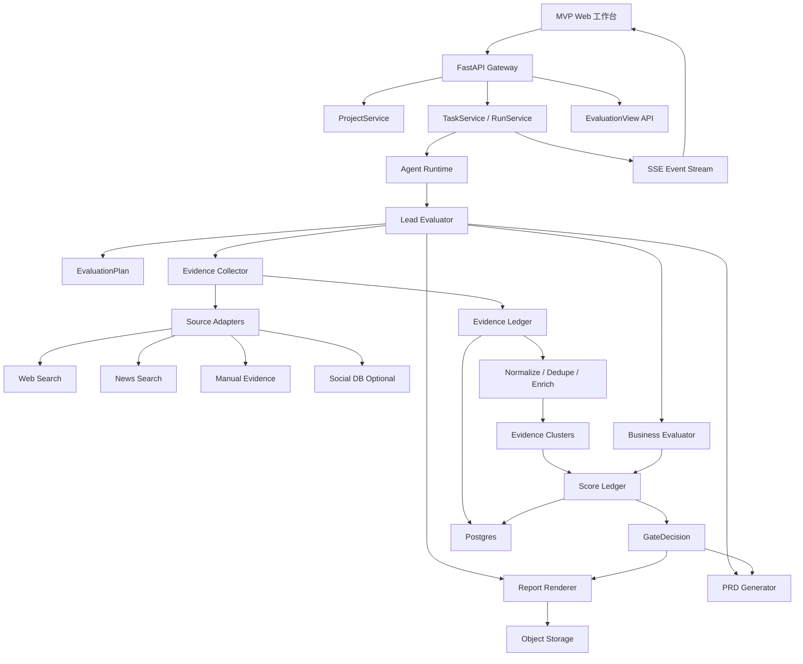
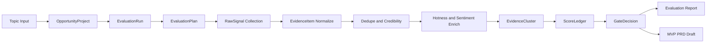

# Gem Cutter MVP 完善版设计

本文是在 MVP 原设计基础上，吸收 DeerFlow、BettaFish、MiroFish 的可迁移经验后形成的“实现版蓝图”。它优先解决 MVP 里最容易漂移的三个问题：

1. 不让系统退化成“舆情报告生成器”。
2. 不让 Agent 用无法复算的自由文本做商业判断。
3. 不把图谱仿真、多平台爬虫、复杂报告 IR 等重能力提前塞进 MVP。

MVP 的主线应固定为：

```text
输入热点/想法 -> 证据生产 -> 证据聚类 -> 评分账本 -> 决策门 -> 报告/PRD 渲染
```

## 1. MVP 完善版定位

MVP 只验证一个核心假设：

> 用户输入一个互联网热点或产品想法后，系统能在有限时间和可控成本内生成可追溯、可复算、可人工审阅的商业可行性判断，并在通过门禁后产出 MVP PRD 草案。

这意味着：

- MVP 的核心资产不是 Markdown 报告，而是 `Evidence Ledger` 和 `Score Ledger`。
- 报告、PRD、前端评分卡都从结构化账本渲染得到。
- Agent 可以参与理解和归纳，但不能绕过证据账本直接给结论。
- BettaFish 的舆情采集/热度/情感能力只作为证据生产增强，不复制它的多进程和日志驱动协作。
- MiroFish 的项目上下文/任务进度/章节化报告能力可以迁移，但 Zep/OASIS 图谱仿真不进入 MVP 主路径。

## 2. MVP 设计原则

| 原则 | 说明 | 来源启发 |
| --- | --- | --- |
| 证据先行 | 每个关键判断必须引用 evidence_id 或标记为 assumption | BettaFish Query/Insight + DeerFlow 工具链 |
| 账本优先 | 评分、置信度、门禁规则由结构化账本驱动 | Gem Cutter 商业评估目标 |
| 服务端持久化上下文 | 前端只传 run_id/project_id，不在接口之间搬运大对象 | MiroFish ProjectManager |
| 长任务化运行 | 评估任务异步执行，支持状态、进度、失败恢复 | MiroFish TaskManager |
| 适配器接入数据源 | Web、News、Social DB、Manual Evidence 统一成 RawSignal | BettaFish InsightEngine |
| 事件驱动前端 | 运行进度用结构化事件，不解析日志 | DeerFlow / 替代 BettaFish ForumEngine |
| 报告只是渲染 | LLM 不直接自由生成最终结论，先产出 JSON，再渲染 Markdown | BettaFish ReportEngine / MiroFish ReportAgent |

## 3. 完善后的 MVP 架构



## 4. 核心链路

完善版 MVP 的运行链路如下：



阶段说明：

| 阶段 | 目标 | 输出 |
| --- | --- | --- |
| `planning` | 将主题拆成评估维度、检索问题、预算 | `EvaluationPlan` |
| `collecting_signals` | 从 Web/News/Manual/Social DB 采集原始信号 | `RawSignal[]` |
| `normalizing_evidence` | 归一化字段、去重、打标签 | `EvidenceItem[]` |
| `enriching_evidence` | 补充热度、情感、可信度、相关性 | enriched `EvidenceItem[]` |
| `clustering_evidence` | 将同类证据聚成主题簇 | `EvidenceCluster[]` |
| `scoring` | 按维度评分和计算置信度 | `ScoreLedger[]` |
| `gate_review` | 生成 go/conditional_go/hold/stop 建议 | `GateDecision` |
| `rendering` | 渲染报告和可选 PRD 草案 | `EvaluationReport` / `PRDReport` |

## 5. MVP 功能范围调整

### 5.1 必做能力

| 模块 | 完善后必做能力 | 说明 |
| --- | --- | --- |
| 热点输入 | 输入主题、关键词、目标市场、补充背景 | 不做自动热点雷达 |
| 项目上下文 | 创建 `OpportunityProject` 和 `EvaluationRun` | 借鉴 MiroFish 项目上下文 |
| 任务运行 | 异步任务、进度、失败状态、SSE 事件 | 不阻塞 HTTP 请求 |
| Source Adapter | Web、News、Manual Evidence 三类适配器 | Social DB 可先做接口不接入 |
| RawSignal | 保存原始搜索/采集结果 | 便于审计和重跑 |
| Evidence Ledger | 标准化证据项、可信度、相关性、状态 | 证据成为一等实体 |
| 热度/情感增强 | 初版用规则或轻量 LLM 标注 | 不训练本地模型 |
| EvidenceCluster | 去重聚类、代表证据、来源多样性 | 支撑评分解释 |
| Score Ledger | 维度评分、权重、置信度、证据引用 | 商业判断可复算 |
| GateDecision | `go`、`conditional_go`、`hold`、`stop` | 和 PRD 生成绑定 |
| 报告渲染 | 从结构化 JSON 渲染 Markdown | 不直接自由写最终报告 |
| PRD 草案 | 仅在 `go/conditional_go` 后生成 | 输出 MVP 范围和验收标准 |
| 前端工作台 | 运行进度、证据板、评分板、报告/PRD | 先做单用户模式 |

### 5.2 明确暂缓

| 暂缓能力 | 暂缓原因 | 后续阶段 |
| --- | --- | --- |
| Zep Graph / GraphRAG | MVP 证据规模不一定需要图谱 | V1/V2 |
| OASIS/CAMEL 仿真 | 依赖重、调试成本高，偏预测研究 | V2 |
| 全平台深度爬虫 | 合规、反爬、维护成本高 | V1 按平台接 |
| 完整 ReportEngine IR/HTML/PDF | 会拖慢 MVP | V1 |
| ForumEngine 式日志解析协作 | 业务协议不应写在日志里 | 不采用 |
| 本地情感模型训练 | MVP 先验证评估链路 | V1 |
| 自动开发/测试/运营/CRM | 已超出 MVP 假设 | 后续产品阶段 |

## 6. 数据模型完善

### 6.1 OpportunityProject

MVP 需要一个比 `Topic` 更接近业务上下文的项目实体：

```text
OpportunityProject
  id
  topic_id
  title
  input_topic
  target_market
  target_user_hint
  constraints
  status
  latest_evaluation_run_id
  latest_report_id
  created_at
  updated_at
```

### 6.2 EvaluationRun

```text
EvaluationRun
  id
  project_id
  topic_id
  status
  stage
  progress
  message
  plan
  budget
  started_at
  finished_at
  error
```

状态建议：

```text
pending -> planning -> collecting_signals -> normalizing_evidence
-> enriching_evidence -> clustering_evidence -> scoring
-> gate_review -> rendering -> completed
```

任何阶段失败进入 `failed`，允许从最近成功 checkpoint 重跑。

### 6.3 RawSignal

```text
RawSignal
  id
  evaluation_run_id
  source_adapter
  source_platform
  source_type
  query
  url
  raw_payload
  fetched_at
  normalization_status
  error
```

RawSignal 解决两个问题：

- 保留源数据，避免后续无法解释 EvidenceItem 从哪来。
- 允许更换 normalization 规则后重建 EvidenceItem。

### 6.4 EvidenceItem

```text
EvidenceItem
  id
  evaluation_run_id
  project_id
  raw_signal_id
  dimension
  title
  content
  summary
  url
  source_platform
  source_type
  content_type
  author
  published_at
  fetched_at
  engagement_metrics
  hotness_score
  sentiment_label
  sentiment_score
  stance_label
  credibility_score
  freshness_score
  relevance_score
  dedupe_hash
  cluster_id
  status
  tags
```

`status` 建议枚举：

```text
candidate | valid | duplicate | invalid | failed | manually_added
```

### 6.5 EvidenceCluster

```text
EvidenceCluster
  id
  evaluation_run_id
  dimension
  label
  summary
  representative_evidence_ids
  evidence_count
  source_diversity
  avg_hotness_score
  avg_sentiment_score
  time_range_start
  time_range_end
```

MVP 的聚类可以先用规则实现：

- URL canonical 去重。
- 标题归一化相似度。
- 简单 token overlap 或 simhash。
- 后续再替换为 embedding clustering。

### 6.6 ScoreLedger

```text
ScoreLedger
  id
  evaluation_run_id
  dimension
  score
  confidence
  weight
  rationale
  positive_evidence_ids
  negative_evidence_ids
  missing_evidence
  assumptions
  created_at
```

这张账本是评分可复算的关键。LLM 可以给维度判断和解释，但后端必须重算：

- 加权总分。
- confidence 上限。
- gate 规则。
- evidence_refs 是否存在。

## 7. 评分体系完善

### 7.1 评分维度

完善版 MVP 使用 7 个维度，比旧版的 TrendScore/OpportunityScore 更适合决策门：

| 维度 | 权重 | 说明 |
| --- | --- | --- |
| `trend_strength` | 20% | 热度、增长迹象、跨平台覆盖、时效性 |
| `user_pain` | 18% | 痛点强度、负面情绪、明确诉求 |
| `monetization` | 18% | 付费意愿、B 端预算、价格锚点、商业场景 |
| `competition_gap` | 14% | 竞品密度、差异化空间、替代方案强度 |
| `execution_feasibility` | 12% | MVP 开发难度、数据可得性、周期和成本 |
| `public_opinion_risk` | 10% | 舆情、合规、版权、隐私、平台风险 |
| `timing_window` | 8% | 事件生命周期、窗口期、可持续性 |

为了兼容旧文档，前端可以把 7 个维度聚合展示成两块：

- 热点价值：`trend_strength`、`timing_window`、`public_opinion_risk`
- 商业价值：`user_pain`、`monetization`、`competition_gap`、`execution_feasibility`

### 7.2 置信度规则

```text
dimension_confidence =
  min(
    llm_confidence,
    evidence_coverage_factor,
    source_diversity_factor,
    credibility_factor,
    freshness_factor
  )
```

硬性上限：

- 该维度有效证据少于 2 条，confidence 最高 45。
- 该维度只有单一来源平台，confidence 最高 60。
- 该维度没有负向或反证检查，confidence 最高 75。
- 引用了不存在的 evidence_id，评分不能进入 final。

### 7.3 Gate 规则

| Gate | 条件 | 后续动作 |
| --- | --- | --- |
| `go` | 总分 >= 75，整体 confidence >= 0.68，无 critical risk | 允许生成 PRD |
| `conditional_go` | 总分 >= 62，confidence >= 0.55，缺口可在 3 天内补齐 | 允许生成带假设的 PRD |
| `hold` | 总分 50-62 或 confidence < 0.55 | 继续补证据或观察 |
| `stop` | 总分 < 50，或 critical risk，或核心假设被反证 | 归档 |

PRD 生成规则：

- `go`：生成完整 MVP PRD 草案。
- `conditional_go`：生成 PRD 草案，但必须列出待验证假设。
- `hold/stop`：不自动生成 PRD，只生成下一步调研建议。

## 8. Agent 与 Skill 设计完善

### 8.1 MVP Agent 最小集合

| Agent | 职责 | 说明 |
| --- | --- | --- |
| `LeadEvaluator` | 编排阶段、维护 EvaluationPlan、触发工具和子任务 | 一个主 Agent 即可 |
| `EvidenceCollector` | 生成检索问题、调用 Source Adapter、产出 RawSignal/EvidenceCandidate | 可实现为 tool + prompt |
| `BusinessEvaluator` | 按 7 个维度生成 ScoreLedger 草案 | 先合并趋势和商业评估 |
| `ReportRenderer` | 从已验证 JSON 渲染 Markdown 报告 | 不引入新事实 |
| `PRDGenerator` | 从 GateDecision 和报告生成 MVP PRD | 仅 gate 通过后触发 |

暂不单独拆 `TrendEvaluatorAgent`、`MarketAnalystAgent`、`ComplianceAgent`。它们在 MVP 中以 skill 或 evaluator 子步骤实现，避免 Agent 过多导致编排复杂。

### 8.2 Skill 列表

| Skill | MVP 必要性 | 输出 |
| --- | --- | --- |
| `hotspot-evidence-collection` | P0 | EvaluationPlan、EvidenceCandidate |
| `social-signal-normalization` | P0 | 热度、平台字段归一化规则 |
| `business-feasibility-scoring` | P0 | ScoreLedger 草案 |
| `competitor-landscape` | P0/P1 | 竞品/替代方案矩阵 |
| `sentiment-and-stance-analysis` | P1 | 情感、立场、风险倾向 |
| `report-rendering` | P0 | Markdown 报告 |
| `mvp-prd-drafting` | P0 | PRD 草案 |

### 8.3 Prompt 关键约束

LeadEvaluator 必须遵守：

```text
你不是报告撰写器，而是商业评估编排器。
你必须先维护 Evidence Ledger，再维护 Score Ledger。
任何评分必须引用 evidence_id；证据不足时输出 missing_evidence。
报告只能根据已验证的结构化 JSON 渲染，不能新增事实。
只有 GateDecision 为 go 或 conditional_go 时才能触发 PRD 生成。
```

EvidenceCollector 必须遵守：

```text
每次工具调用必须绑定 dimension 和 research_question。
输出 EvidenceCandidate 时必须包含 url/source/published_at/relevance_reason。
不要把搜索摘要当作事实；必须保留来源和不确定性。
```

BusinessEvaluator 必须遵守：

```text
只使用 Evidence Ledger 中的证据。
每个维度输出 score、confidence、rationale、positive_evidence_ids、negative_evidence_ids、missing_evidence。
如果证据不足，不要给高分；降低 confidence 并请求补搜。
```

## 9. Source Adapter 设计

### 9.1 统一接口

```text
SourceAdapter.search(request) -> RawSignal[]
```

请求字段：

```text
topic
dimension
research_question
query
freshness_days
region
limit
```

### 9.2 MVP 适配器

| Adapter | MVP 状态 | 说明 |
| --- | --- | --- |
| `WebSearchAdapter` | P0 | 通用网页搜索 |
| `NewsSearchAdapter` | P0 | 近期新闻/媒体 |
| `ManualEvidenceAdapter` | P0 | 用户手动添加链接/文本 |
| `SocialDBAdapter` | P1 | 接 BettaFish/MediaCrawlerDB 类数据源 |
| `MultimodalSearchAdapter` | P2 | 图片/视频/短视频证据 |

### 9.3 热度归一化

不同平台互动指标不能直接相加。MVP 初版规则：

```text
platform_hotness = weighted_engagement / platform_baseline
hotness_score = clamp(log1p(platform_hotness) * freshness_factor, 0, 1)
```

如果没有平台基线，先使用保守规则：

- 新闻/官网：以发布时间和来源权威度为主。
- 社区/论坛：以评论数、点赞数、收藏数、转发数为主。
- 用户手动证据：不参与热度加权，只参与可信度和相关性。

## 10. API 完善

### 10.1 核心 API

| 方法 | 路径 | 说明 |
| --- | --- | --- |
| `POST` | `/api/projects` | 创建 OpportunityProject |
| `POST` | `/api/projects/{id}/evaluations` | 启动 EvaluationRun |
| `GET` | `/api/evaluations/{id}` | 获取运行状态 |
| `GET` | `/api/evaluations/{id}/stream` | SSE 事件流 |
| `GET` | `/api/evaluations/{id}/view` | 获取聚合评估视图 |
| `GET` | `/api/evaluations/{id}/evidence` | 获取 Evidence Ledger |
| `POST` | `/api/evaluations/{id}/evidence/manual` | 人工添加证据 |
| `PATCH` | `/api/evidence/{id}` | 人工标记证据状态 |
| `GET` | `/api/evaluations/{id}/scores` | 获取 Score Ledger |
| `POST` | `/api/evaluations/{id}/gate-decisions` | 保存人工门禁 |
| `POST` | `/api/evaluations/{id}/reports` | 重新渲染报告 |
| `POST` | `/api/evaluations/{id}/prd` | 生成 PRD 草案 |

### 10.2 EvaluationView

前端主页面只依赖一个聚合视图：

```json
{
  "project": {},
  "run": {},
  "plan": {},
  "evidence_summary": {
    "raw_signal_count": 0,
    "valid_evidence_count": 0,
    "cluster_count": 0,
    "source_diversity": 0,
    "avg_credibility": 0,
    "avg_hotness": 0
  },
  "score_summary": {
    "total_score": 0,
    "overall_confidence": 0,
    "dimensions": []
  },
  "gate_decision": {},
  "latest_report": {},
  "latest_prd": {}
}
```

## 11. SSE 事件完善

| Event | Payload | 用途 |
| --- | --- | --- |
| `evaluation.started` | run_id, project_id | 任务开始 |
| `plan.created` | dimension_count, query_budget | 展示计划 |
| `evidence.search_started` | dimension, query | 正在查什么 |
| `raw_signal.added` | source_adapter, count | 原始信号入账 |
| `evidence.added` | evidence_id, title, credibility | 证据入账 |
| `evidence.clustered` | cluster_count | 聚类完成 |
| `sentiment.updated` | evidence_count | 情感/立场标注完成 |
| `score.updated` | dimension, score, confidence | 维度评分更新 |
| `gate.decided` | gate, total_score, confidence | 决策门结果 |
| `report.generated` | report_id | 报告完成 |
| `prd.generated` | prd_report_id | PRD 完成 |
| `evaluation.failed` | stage, error | 失败 |
| `evaluation.completed` | run_id | 完成 |

## 12. 前端工作台完善

MVP 前端建议分成 5 个主区：

| 区域 | 组件 | 目标 |
| --- | --- | --- |
| 输入区 | `TopicBriefForm` | 输入主题、市场、用户、约束 |
| 运行区 | `RunTimeline`、`EventStream` | 展示实时阶段和错误 |
| 证据区 | `EvidenceBoard`、`ClusterList` | 按维度展示证据、来源和聚类 |
| 评分区 | `ScoreLedgerPanel`、`GateDecisionPanel` | 展示分数、置信度、证据引用 |
| 产物区 | `ReportViewer`、`PrdViewer` | 展示报告和 PRD 草案 |

关键交互：

- 人工添加证据：粘贴 URL 或文本。
- 标记证据状态：valid/invalid/duplicate。
- 对某一维度触发补搜。
- 查看某个评分维度引用了哪些证据。
- 覆盖 GateDecision 并记录理由。
- gate 通过后生成 PRD。

## 13. 开发迭代调整

### M0：骨架和数据账本

交付：

- FastAPI/Next.js 基础骨架。
- Postgres schema：`opportunity_projects`、`evaluation_runs`、`raw_signals`、`evidence_items`、`evidence_clusters`、`score_ledgers`、`gate_decisions`、`evaluation_reports`。
- EvaluationRun 状态机。
- SSE 事件流。

### M1：证据生产

交付：

- `WebSearchAdapter`、`NewsSearchAdapter`、`ManualEvidenceAdapter`。
- RawSignal 保存。
- EvidenceItem normalize/dedupe/credibility。
- EvidenceBoard 前端初版。

### M2：商业评分

交付：

- EvaluationPlan。
- 7 维 ScoreLedger。
- confidence 规则和 gate 规则。
- ScoreLedgerPanel 和 GateDecisionPanel。

### M3：报告和 PRD

交付：

- 结构化评估 JSON schema。
- Markdown report renderer。
- PRD generator。
- 报告/PRD 前端展示。

### M4：稳定化和演示

交付：

- 3-5 个固定回归主题。
- 证据不足、高风险、竞品饱和、低商业化等回归 case。
- 人工证据标注和补搜。
- 错误恢复、重跑、日志审计。

## 14. MVP 验收标准完善

| 类别 | 验收标准 |
| --- | --- |
| 证据 | 单次评估至少采集 12 条 RawSignal，形成至少 6 条有效 EvidenceItem，至少覆盖 2 类来源 |
| 聚类 | 至少能把重复/相近证据合并，输出 EvidenceCluster |
| 评分 | 7 个评分维度均有 ScoreLedger；核心维度必须引用 evidence_id |
| 置信度 | 证据不足时不能高置信度；单源证据 confidence 自动受限 |
| 门禁 | 有 critical risk 或有效证据少于阈值时不得给 `go` |
| 报告 | Markdown 报告中所有关键判断能定位到 evidence_id 或 assumption |
| PRD | 只有 `go/conditional_go` 才能生成 PRD；`conditional_go` 必须列出待验证假设 |
| 前端 | 用户能看到运行阶段、证据板、评分板、门禁结果和报告 |
| 复盘 | 每次评估能查看输入、任务状态、证据、评分、报告和人工覆盖记录 |

## 15. 与旧 MVP 文档的关系

本文不推翻原有 `08` 和 `09` 文档，而是做收敛和增强：

- `08-mvp-scope-and-development-plan.md` 提供 MVP 范围、页面、开发计划。
- `09-mvp-business-evaluation-chain-design.md` 提供商业评估链路的 Skill/Prompt/Guardrails。
- 本文将 BettaFish/MiroFish 的对标结论正式纳入 MVP 实现蓝图，作为实际开发时的优先参考。

开发时建议以本文为 MVP 主设计入口，再回到 `08` 和 `09` 查看细节。
