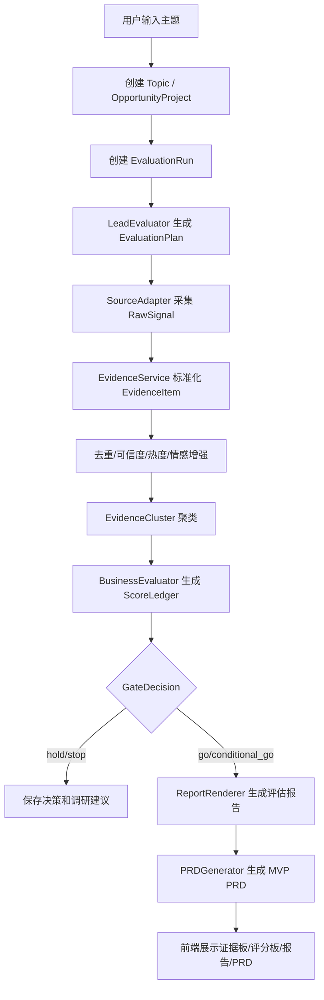

# Gem Cutter MVP 核心需求与开发方案

> Status: Archive.
> Scope: 早期 MVP 范围和开发方案，保留历史上下文；当前开发以 `../current/` 为准。

> 更新说明：基于 BettaFish/MiroFish 对标后的完善版 MVP 设计，实际开发时应优先参考 [../current/evaluation-chain.md](../current/evaluation-chain.md)。本文保留原始 MVP 范围和计划，并将核心口径升级为“证据账本 + 评分账本 + 决策门 + 报告/PRD 渲染”。

## 1. MVP 定位

MVP 的目标不是一次性做完整的“热点、商业评估、设计、开发、运营、CRM、舆情”大闭环，而是先验证最关键的产品假设：

> 用户输入一个互联网热点或候选想法后，系统能在可接受时间内生成有证据支撑、可追溯、可人工决策的商业机会评估报告，并进一步产出一份可进入原型开发的 MVP PRD 草案。

因此 MVP 应聚焦“研究评估链路 + PRD 草案”，暂不把自动开发、完整运营、完整 CRM、实时舆情作为核心交付。

## 2. MVP 成功标准

| 目标 | 衡量标准 |
| --- | --- |
| 能发现和整理信息 | 单个主题至少收集 5 条候选证据，其中至少 3 条有效证据进入报告 |
| 能做可解释评分 | 热点评分和商业机会评分都能展开维度、权重、证据引用和假设 |
| 能辅助决策 | 报告给出 `继续调研`、`快速原型`、`观察`、`归档` 中的建议 |
| 能转为产品需求 | 对通过门禁的机会生成 MVP PRD 草案 |
| 能复盘 | 保存 Agent 运行记录、报告版本、证据引用、人工决策 |
| 能演示闭环 | 前端从输入主题到查看报告、点击进入 PRD 生成，流程可完整跑通 |
| 能复算 | 保存 RawSignal、EvidenceItem、EvidenceCluster、ScoreLedger，报告结论可回溯到结构化账本 |

MVP 的验收口径：选择 3 个真实热点主题试跑，至少 2 个能生成结构完整、证据可追溯、人工认为“有讨论价值”的报告。

## 3. MVP 用户与场景

### 3.1 首批用户

| 用户 | 使用动机 | MVP 支持方式 |
| --- | --- | --- |
| 独立开发者 | 想快速判断一个热点能不能做成小产品 | 输入主题，获得评分报告和 MVP PRD |
| 产品经理 | 想把热点转成需求讨论材料 | 获得用户画像、竞品、功能范围和验收标准 |
| 创业/创新团队 | 想筛选候选方向 | 对比多个 Opportunity 的评分和建议 |

### 3.2 核心用户故事

- 作为独立开发者，我可以输入“AI 生成短视频脚本工具”等主题，让系统自动搜集资料并生成机会报告。
- 作为产品经理，我可以查看每个结论引用了哪些证据，判断报告是否可信。
- 作为团队负责人，我可以把机会标记为“快速原型”或“归档”，并记录人工决策理由。
- 作为研发负责人，我可以从机会报告生成 MVP PRD，看到功能范围、任务拆分和验收标准。

## 4. MVP 范围

### 4.1 必做范围

| 模块 | 必做能力 | 产物 |
| --- | --- | --- |
| 热点输入 | 手动输入主题、关键词、补充背景 | Topic |
| 证据采集 | Web 搜索、网页摘要、证据去重、证据可信度 | Evidence Pack |
| 机会创建 | 从 Topic 创建 Opportunity | Opportunity |
| 热点评分 | 当前热度、增长迹象、持续性、传播广度、证据可信度 | TrendScore |
| 商业评分 | 用户痛点、变现潜力、竞争空间、执行可行性、风险 | OpportunityScore |
| 报告生成 | Markdown 报告 + 结构化 JSON | EvaluationReport |
| 阶段门禁 | 观察、继续调研、快速原型、归档 | GateDecision |
| PRD 草案 | 背景、用户、场景、MVP 范围、验收标准、不做范围 | PRD Report |
| 前端工作台 | 主题输入、机会列表、证据包、评分卡、报告页 | Workspace UI |
| 审计记录 | AgentRun、工具调用摘要、人工决策记录 | Audit Log |
| 任务状态 | EvaluationRun、阶段进度、SSE 事件、失败恢复 | Run Timeline |
| 证据账本 | RawSignal、EvidenceItem、EvidenceCluster | Evidence Ledger |
| 评分账本 | 维度评分、权重、置信度、证据引用 | Score Ledger |

### 4.2 可选但建议做

- 报告导出为 Markdown 文件。
- 证据人工标记为有效/无效。
- 简单的模型和搜索工具配置页面。
- 报告重新生成。
- 同一个 Topic 下多个 Opportunity 对比。

### 4.3 MVP 明确不做

| 不做项 | 原因 | 替代方案 |
| --- | --- | --- |
| 自动定时热点雷达 | 数据源和聚类复杂，容易拖慢主链路 | 先支持手动输入主题 |
| 自动生成完整可上线产品 | 对沙箱、测试、设计要求高 | 先生成 PRD 和开发建议 |
| 完整 CRM | 与 MVP 主假设距离较远 | 预留 Customer/Feedback 设计 |
| 实时舆情监控 | 依赖多平台接入和告警系统 | 先在报告里输出风险项 |
| 多租户计费 | 早期不验证商业评估质量 | 单用户或本地团队模式 |
| 复杂权限体系 | 增加实现成本 | 先用本地/单管理员模式 |

## 5. MVP 主流程



## 6. MVP 信息架构

### 6.1 页面

| 页面 | 功能 |
| --- | --- |
| 首页/工作台 | 输入主题、查看最近机会 |
| 机会列表 | 展示 Opportunity 列表、评分、阶段、推荐动作 |
| 机会详情 | 展示摘要、评分卡、证据包、报告、人工门禁 |
| 报告页 | Markdown 阅读、证据引用、重新生成 |
| PRD 页 | 展示 MVP PRD 草案、功能范围、验收标准 |
| 运行详情页 | 查看 AgentRun 状态、错误、耗时、成本 |
| 设置页 | 配置模型、搜索工具、基本系统参数 |

### 6.2 前端 MVP 交互

- 用户在工作台输入主题，点击“开始评估”。
- 前端创建 Topic 和 Evaluation Run。
- 页面进入机会详情，显示运行状态。
- SSE 流式展示 Agent 进度。
- 完成后展示评分卡、证据列表、评估报告。
- 用户点击“生成 PRD”。
- 系统生成 PRD 报告并进入 PRD 页。

## 7. MVP Agent 设计

### 7.1 Agent 最小集合

| Agent | MVP 是否需要 | 说明 |
| --- | --- | --- |
| LeadAgent | 必须 | 负责任务编排、阶段推进、汇总 |
| HotspotScoutAgent | 必须 | 搜索、证据采集、摘要 |
| TrendEvaluatorAgent | 必须 | 生成 TrendScore |
| MarketAnalystAgent | 必须 | 生成 OpportunityScore 和商业判断 |
| PMAgent | 必须 | 生成 MVP PRD |
| ComplianceAgent | 轻量内嵌 | 先作为风险检查函数或 Skill，不单独做复杂 Agent |
| DevAgent | 暂不做 | P2 阶段再做 |
| QAAgent | 暂不做 | P2 阶段再做 |
| Ops/CRM/Sentiment | 暂不做 | P3 阶段再做 |

### 7.2 MVP Skills

初始只需要 4 个 Skills：

- `hotspot-research`：如何检索、筛选、总结证据。
- `business-feasibility`：如何做评分、风险和反证。
- `competitor-analysis`：如何识别竞品和替代方案。
- `prd-writing`：如何从机会报告生成 MVP PRD。

完善版建议将 Skill 口径升级为：

- `hotspot-evidence-collection`：围绕评估维度生成检索问题并产出 EvidenceCandidate。
- `social-signal-normalization`：归一化平台热度、互动、来源字段。
- `business-feasibility-scoring`：生成 ScoreLedger 草案和 evidence gap。
- `competitor-landscape`：识别直接竞品、间接竞品、替代方案。
- `report-rendering`：从结构化 JSON 渲染 Markdown 报告，不新增事实。
- `mvp-prd-drafting`：仅在 gate 通过后生成 MVP PRD 草案。

## 8. MVP 评分模型

> 完善版设计建议实际实现时采用 7 维 `ScoreLedger`：`trend_strength`、`user_pain`、`monetization`、`competition_gap`、`execution_feasibility`、`public_opinion_risk`、`timing_window`。下面的 TrendScore/OpportunityScore 可作为前端聚合展示口径，而不是底层唯一评分表。

### 8.1 TrendScore

```json
{
  "current_heat": 0,
  "growth_signal": 0,
  "durability": 0,
  "spread_width": 0,
  "evidence_quality": 0,
  "total": 0,
  "confidence": 0,
  "evidence_refs": []
}
```

建议权重：

| 维度 | 权重 |
| --- | --- |
| current_heat | 25% |
| growth_signal | 20% |
| durability | 20% |
| spread_width | 15% |
| evidence_quality | 20% |

### 8.2 OpportunityScore

```json
{
  "user_pain": 0,
  "monetization": 0,
  "competition_gap": 0,
  "execution_feasibility": 0,
  "risk_control": 0,
  "total": 0,
  "confidence": 0,
  "evidence_refs": []
}
```

建议权重：

| 维度 | 权重 |
| --- | --- |
| user_pain | 25% |
| monetization | 25% |
| competition_gap | 20% |
| execution_feasibility | 15% |
| risk_control | 15% |

### 8.3 推荐动作规则

| 条件 | 推荐动作 |
| --- | --- |
| OpportunityScore >= 75 且 risk_control >= 60 | 快速原型 |
| OpportunityScore >= 60 且 evidence_quality >= 60 | 继续调研 |
| TrendScore >= 65 但 OpportunityScore < 60 | 观察 |
| risk_control < 40 或 evidence_quality < 40 | 归档/谨慎处理 |

## 9. MVP 数据模型

MVP 只实现最小表集合：

| 表 | 用途 |
| --- | --- |
| topics | 热点主题 |
| opportunity_projects | 评估项目上下文 |
| evaluation_runs | 评估任务状态、阶段、进度、计划 |
| raw_signals | 原始搜索/采集结果 |
| evidence_items | 证据项 |
| evidence_clusters | 证据聚类、代表样本、来源多样性 |
| score_ledgers | 维度评分、权重、置信度、证据引用 |
| opportunities | 商业机会 |
| evaluation_reports | 评估报告和 PRD 报告 |
| gate_decisions | 人工门禁决策 |
| agent_runs | Agent 执行记录 |
| artifacts | Markdown 文件、抓取原文、导出结果 |

后续表如 `customers`、`sentiment_signals`、`campaigns` 暂不创建，避免过早复杂化。

## 10. MVP 后端开发方案

### 10.1 模块划分

```text
backend/
  app/
    gateway/
      routers/
        topics.py
        opportunities.py
        evidence.py
        reports.py
        runs.py
    domain/
      topics/
      opportunities/
      evidence/
      reports/
      scoring/
      workflows/
  packages/
    harness/
      gemcutter/
        agents/
          lead_agent/
          hotspot_scout/
          trend_evaluator/
          market_analyst/
          pm_agent/
        tools/
        skills/
        runtime/
```

### 10.2 API 草案

| 方法 | 路径 | 说明 |
| --- | --- | --- |
| POST | `/api/topics` | 创建 Topic |
| GET | `/api/topics` | 查询 Topic 列表 |
| GET | `/api/topics/{topic_id}` | 查询 Topic 详情 |
| POST | `/api/topics/{topic_id}/evaluate` | 启动评估任务 |
| GET | `/api/opportunities` | 查询机会列表 |
| GET | `/api/opportunities/{id}` | 查询机会详情 |
| POST | `/api/opportunities/{id}/gate-decisions` | 保存人工门禁 |
| POST | `/api/opportunities/{id}/prd` | 启动 PRD 生成 |
| GET | `/api/opportunities/{id}/evidence` | 查询证据包 |
| GET | `/api/reports/{id}` | 查询报告 |
| GET | `/api/runs/{id}` | 查询运行状态 |
| GET | `/api/runs/{id}/stream` | SSE 流式进度 |

### 10.3 后端实现顺序

1. 数据库迁移和 ORM 模型。
2. Project/EvaluationRun/RawSignal/Evidence/ScoreLedger/Report 的 CRUD。
3. AgentRun 与 SSE 基础运行。
4. Web/News/Manual Source Adapter。
5. 证据标准化、去重、可信度、热度和情感初版。
6. 7 维评分函数、confidence 限制、gate 规则和 JSON schema 校验。
7. 报告渲染与存储。
8. gate 通过后的 PRD 生成。
9. 错误处理、重试、审计日志。

## 11. MVP 前端开发方案

### 11.1 页面优先级

| 优先级 | 页面 | 说明 |
| --- | --- | --- |
| P0 | 工作台首页 | 输入主题，触发评估 |
| P0 | 机会详情页 | 展示评估过程和结果 |
| P0 | 报告阅读页 | Markdown 报告、证据引用 |
| P1 | 机会列表页 | 多机会筛选和排序 |
| P1 | PRD 页 | PRD 草案和功能拆分 |
| P2 | 设置页 | 模型和工具配置 |
| P2 | 运行详情页 | 调试和失败定位 |

### 11.2 组件

- `TopicInput`
- `OpportunityCard`
- `ScoreCard`
- `EvidenceList`
- `ReportViewer`
- `GateDecisionPanel`
- `RunProgressStream`
- `PrdSectionViewer`

## 12. MVP 基础设施

本地开发建议：

- SQLite：本地开发业务数据库，使用关系表保存证据链与运行状态。
- Redis：运行状态、异步任务、缓存。
- MinIO：报告、抓取原文、导出文件。
- FastAPI：后端 API。
- React + Vite：前端。

MVP 可以暂缓：

- ClickHouse。
- Kubernetes。
- 多租户鉴权。
- 独立任务编排引擎 Temporal。

## 13. MVP 测试策略

### 13.1 单元测试

- 评分函数测试。
- 证据去重测试。
- URL 和来源解析测试。
- Report JSON schema 校验测试。
- GateDecision 状态流转测试。

### 13.2 集成测试

- 创建 Topic -> 启动评估 -> 保存 Evidence -> 生成 Report。
- 机会门禁 -> 生成 PRD。
- 搜索工具失败时报告降级。
- AgentRun 中断/失败状态处理。

### 13.3 人工验收测试

准备 3 到 5 个测试主题：

- 一个明显高热度主题。
- 一个热度高但商业化弱的主题。
- 一个小众但商业可行的主题。
- 一个高风险或版权风险主题。

验收关注：

- 证据是否真实可点开。
- 评分是否有解释。
- 风险是否被识别。
- PRD 是否能指导下一步原型开发。

## 14. MVP 里程碑

| 里程碑 | 周期 | 交付 |
| --- | --- | --- |
| M0 项目骨架 | 第 1 周 | 前后端启动、数据库、基础 API |
| M1 数据与 CRUD | 第 2 周 | Topic、Evidence、Opportunity、Report |
| M2 Agent 评估链路 | 第 3-4 周 | 搜索、证据、评分、报告 |
| M3 前端工作台 | 第 5 周 | 输入、机会详情、报告展示 |
| M4 PRD 生成与门禁 | 第 6 周 | GateDecision、PRD 报告 |
| M5 稳定化 | 第 7 周 | 测试、错误处理、演示数据 |

## 15. MVP 主要风险

| 风险 | 影响 | 缓解 |
| --- | --- | --- |
| 搜索结果质量不稳定 | 报告质量波动 | 支持人工补充证据，记录证据质量 |
| Agent 输出结构不稳定 | 前端难以展示 | 强制 JSON schema 校验，不通过则重试或降级 |
| 评分过于主观 | 用户不信任 | 展示评分维度、权重、证据和假设 |
| 抓取失败 | 证据不足 | 保存搜索摘要，标记抓取失败原因 |
| 范围膨胀 | MVP 延期 | 明确不做自动开发、CRM、实时舆情 |

## 16. MVP 最小演示脚本

1. 打开工作台。
2. 输入一个热点主题，例如“AI 视频脚本生成工具”。
3. 点击“开始评估”。
4. 观察 Agent 进度：搜索、证据整理、评分、报告生成。
5. 查看机会详情：证据包、TrendScore、OpportunityScore。
6. 打开评估报告，检查关键结论引用证据。
7. 点击“快速原型/继续调研”。
8. 系统生成 MVP PRD。
9. 展示 PRD 中的功能范围、用户故事、验收标准和不做范围。
